# Week3 基础：Hermes soak 实验记录

## 实验范围与结论

本阶段使用 `hermes-standalone-soak.mjs 2.1.0` 和本机 Hermes 0.20.5，通过真实 CLI 连续调用模型。

| 实验 | 原始证据目录 | 真实结果 |
| --- | --- | --- |
| 正常三轮 | `evidence/basic-pass-20260909/` | 3/3 PASS，额外记忆探针 1/1 通过，耗时 190.703 秒，正常完成 |
| 总时长受限 | `evidence/basic-20260909/` | 请求 6 轮，5 轮成功、第 6 轮取消失败，600.184 秒后以 `duration_reached` 结束，FAIL |
| 无效 API Key | `evidence/negative-20260909/` | HTTP 401，错误分类 `authentication`，0/1 通过，FAIL |

## 配置与复现

命令在当前阶段目录的 PowerShell 中执行，默认写入新的 `results/` 子目录，不覆盖提交证据。

```powershell
./run-basic-soak.ps1 -Rounds 6 -Interval 1s -Duration 10m
```

第二条命令复用历史受限尝试的参数，不保证再次触发同样的上游延迟。总时长控制覆盖版本检查、当前请求、重试、等待和探针；只有完成指定轮次并满足成功率、探针条件，才能 PASS。

## 图片来源

本阶段的 12 张图片只存放在 `Figure_week3.1/`。

## 正常三轮对话

### 图 01：三轮、1 秒间隔和 10 分钟上限

读取正常组 `meta.json` 中实际生效的参数：`rounds=3`、`intervalMs=1000`、`durationMs=600000`、`roundTimeoutMs=180000`。

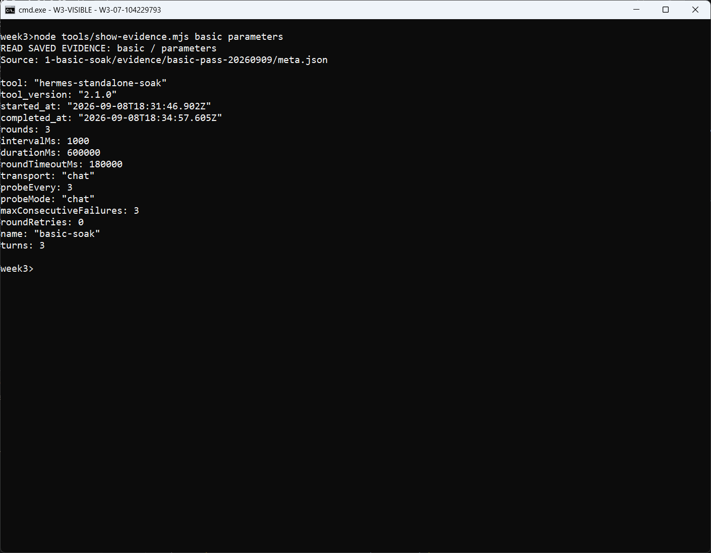

### 图 02：第 1、2 轮真实回复与偏好植入

`conversations.jsonl` 的前半段记录连续对话和偏好植入：LinXiao、Python、PowerShell。记录保留请求、回复、耗时及判定。

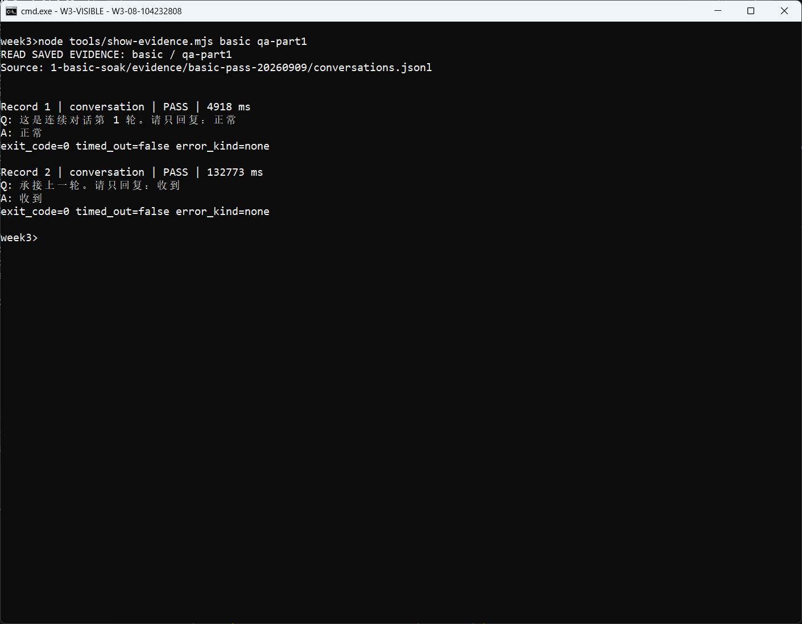

### 图 03：第 3 轮真实回复与回忆核对

同一 JSONL 的后半段展示第 3 轮及额外回忆调用，探针命中 LinXiao、Python、PowerShell。探针调用不计入普通对话的三轮。

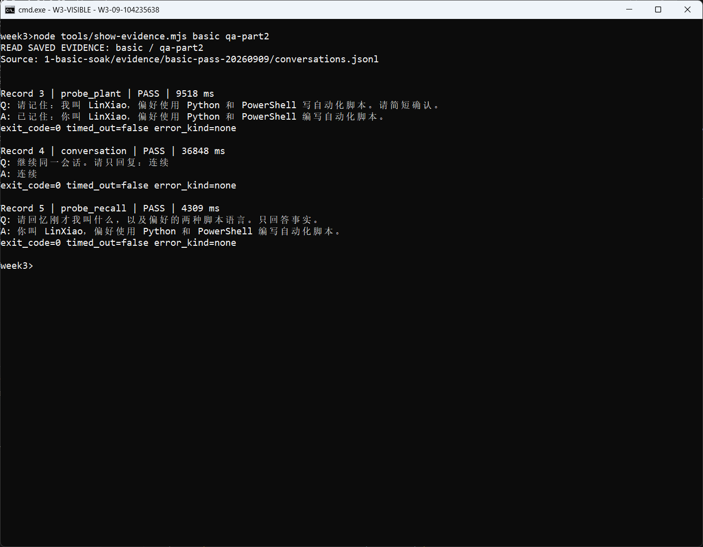

### 图 04：3/3 PASS 与正常结束汇总

`meta.json` 和 `report.txt` 记录 `status=pass`、`termination_reason=completed`，耗时 190.703 秒，P50/P95 为 36.848/132.773 秒，额外探针 1/1 通过。

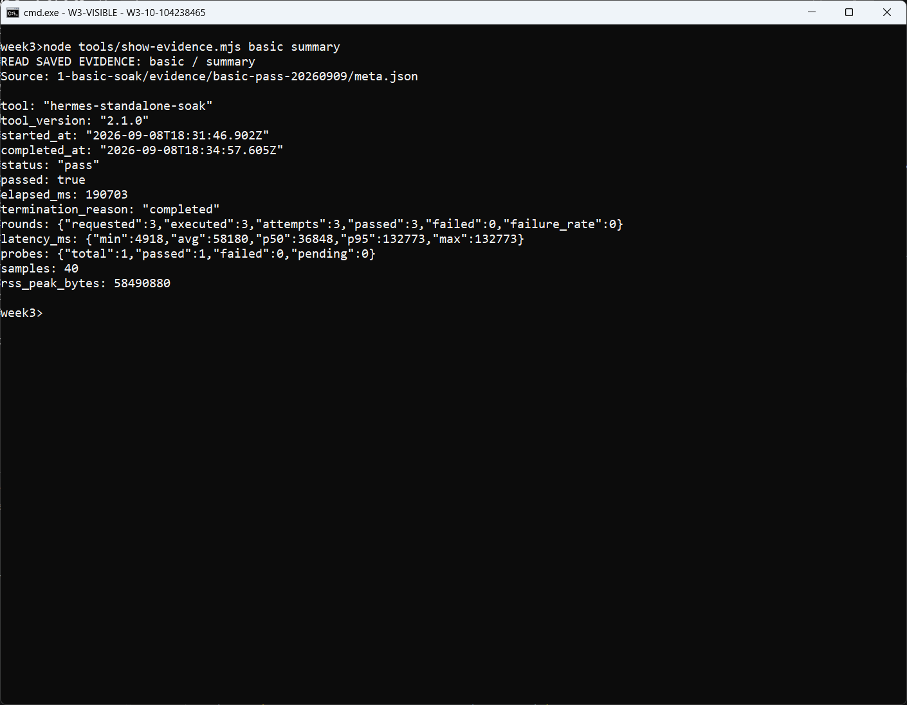

## 真实总时长受限尝试

### 图 05：六轮与 600 秒总时长参数

读取受限组 `meta.json`：目标 6 轮，间隔 1 秒，总时长 10 分钟。此组是另一轮真实模型尝试，不是离线超时模拟。

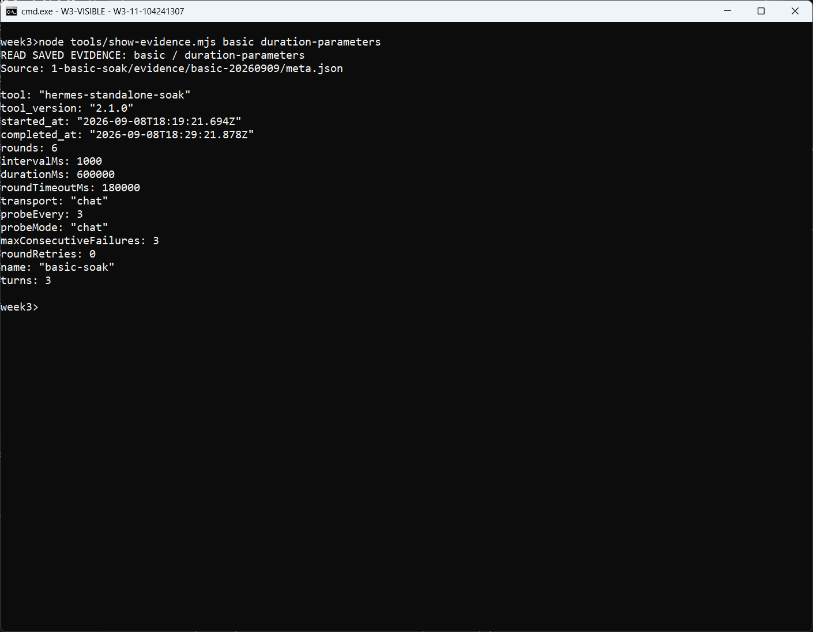

### 图 06：到期前的前半段对话

读取受限组 `conversations.jsonl` 前半段，展示前几次正常响应及第一组偏好记忆调用；这些成功记录不能单独证明整次实验通过。

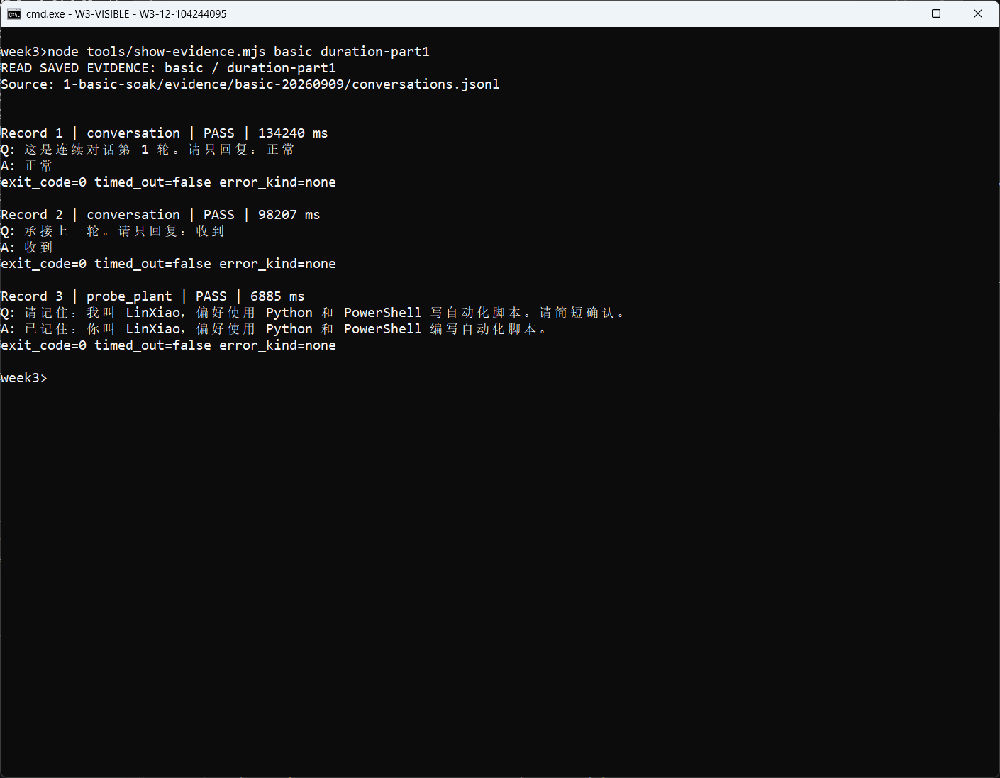

### 图 07：后续对话与部署约束植入

继续读取同一 JSONL 的后半段，展示后续问答和生产部署约束植入。上游响应较慢，第二次探针植入发生单轮超时，原始失败记录保留。

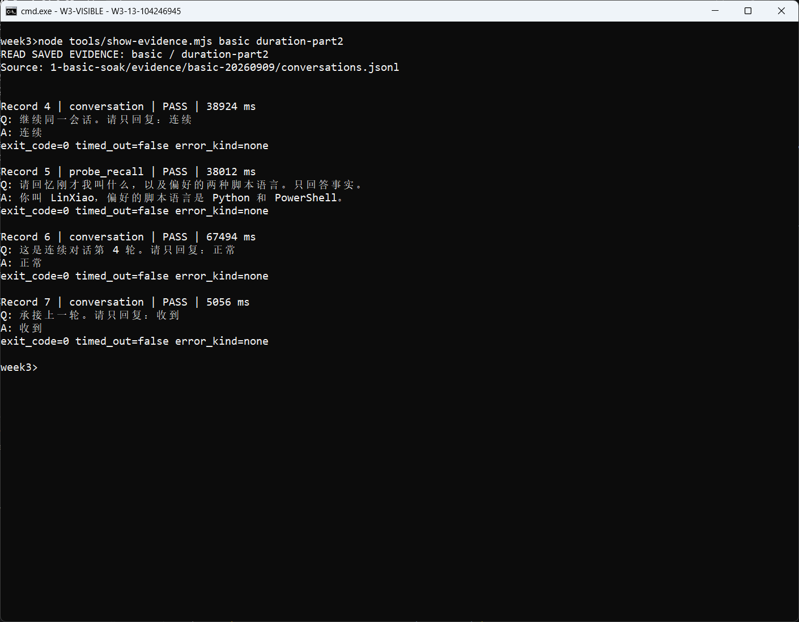

### 图 08：探针超时与第 6 轮到期取消

联合查看 `terminal.log` 和 JSONL 中的错误记录。第 6 轮执行期间达到总时长，活动任务被取消，错误原因为 `duration_reached`，没有继续等待完整单轮超时。

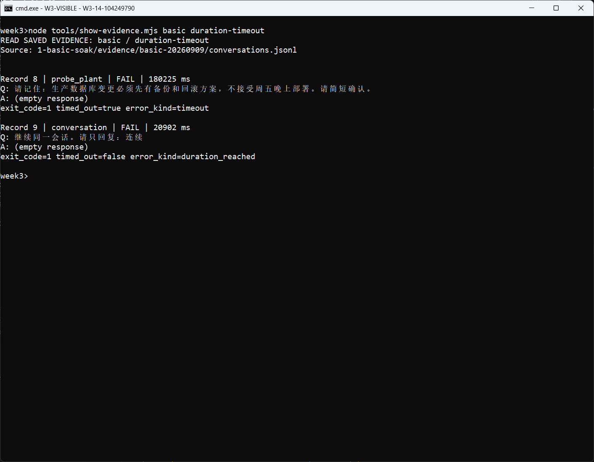

### 图 09：部分成功仍判 FAIL

最终 5 轮成功、1 轮失败，`status=fail`、`termination_reason=duration_reached`。耗时 600.184 秒，比 600 秒预算多约 0.184 秒，用于清理和结果落盘；本组不作为正常通过证据。

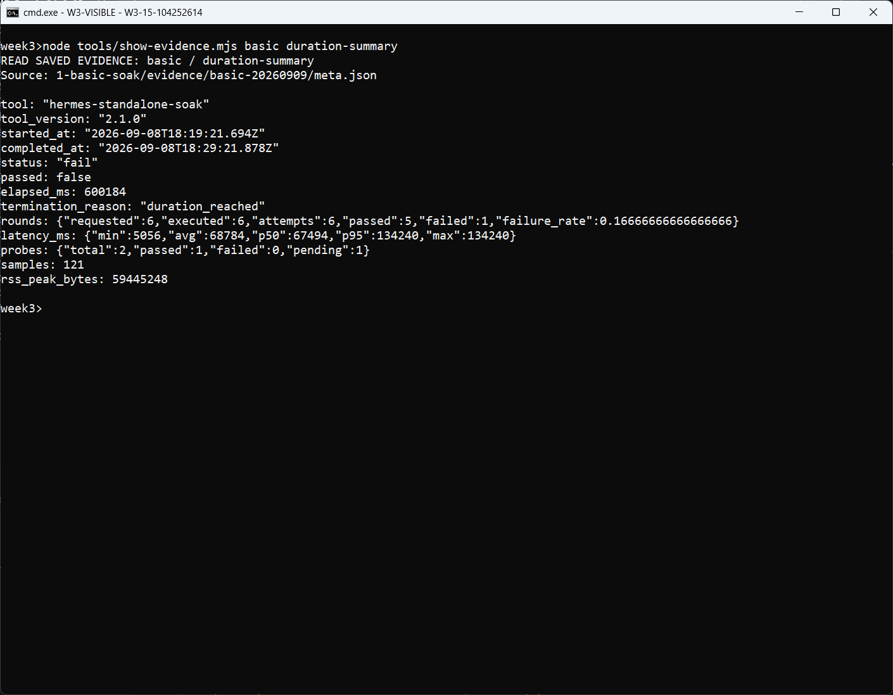

## 无效 API Key 尝试

### 图 10：单轮负向请求参数

读取负向组 `meta.json`，确认单轮、`oneshot` 传输、零间隔和连续失败阈值 1。脚本使用故意构造的无效 Key，不展示真实密钥。

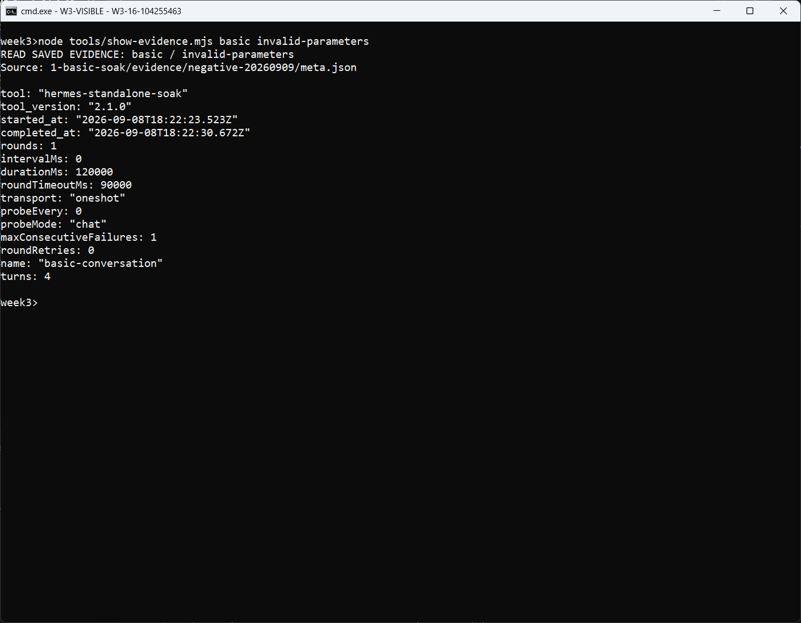

### 图 11：真实 HTTP 401 与认证失败分类

`conversations.jsonl` 保存真实返回 `HTTP 401: Invalid token`，错误分类为 `authentication`；不是仅按命令退出状态推测原因。

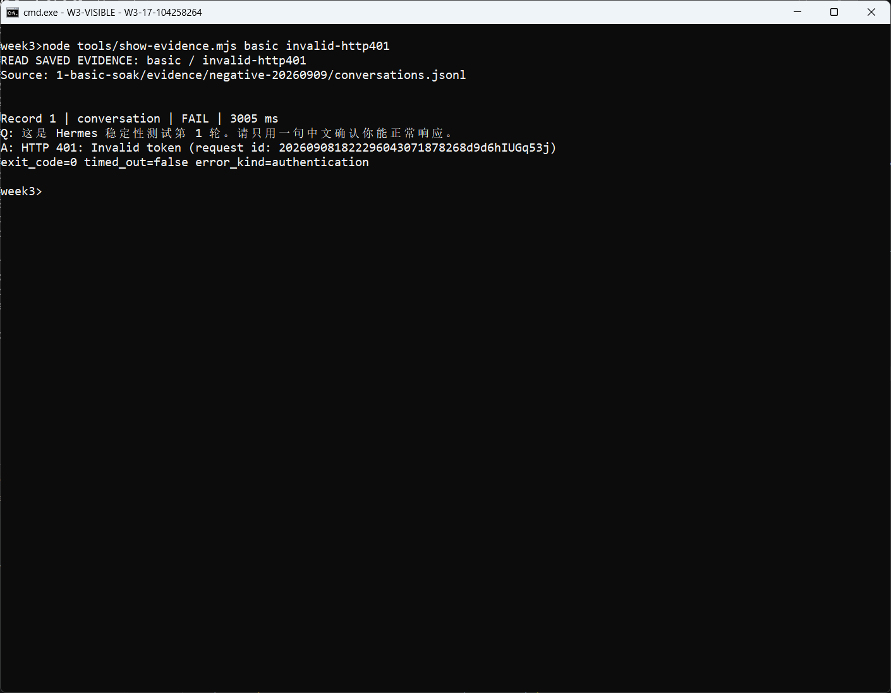

### 图 12：0/1 通过与 FAIL 汇总

soak 退出码为 1，最终为 FAIL，终止原因 `consecutive_failures`。包装脚本确认预期认证失败后返回 0，只表示负向验证成功，不代表对话通过。

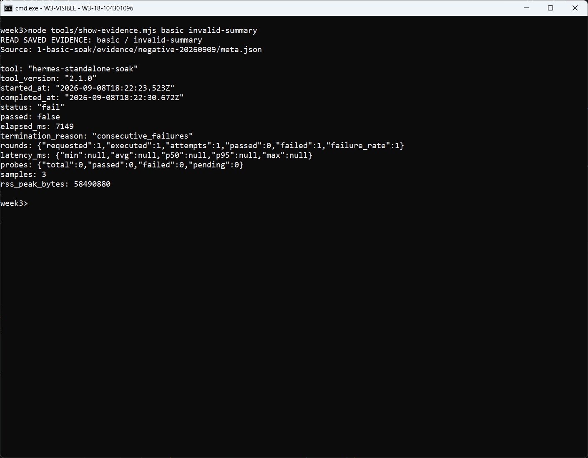

