# Week3 进阶一：L0–L3 记忆实验记录

## 实验目标与结果

在隔离 Docker 容器中安装 Hermes 和记忆插件，从空数据目录开始进行富事实对话，检查 L0 原始对话、L1 提取事实、L2 场景记忆和 L3 用户画像，再通过独立会话执行中文召回。

| 检查项 | 已保存的真实结果 |
| --- | --- |
| 普通对话与额外探针 | 6/6 PASS；Gateway 探针 1/1 PASS |
| soak 耗时与延迟 | 378.511 秒；P50/P95 为 22.690/136.225 秒 |
| 初始数据 | `fresh=true`，L0/L1/L2 文件数及 persona 数量均为 0 |
| L0 与 L1 | 14 条原始记录、11 条提取记录；非法 JSONL 记录均为 0 |
| L2 与 L3 | 1 个有正文的 scene block、1 个有正文的 persona 文件 |
| 独立中文召回 | HTTP 200；LinXiao、Python、PowerShell 三个验收关键词全部命中 |
| 最终判定 | `status=pass`；soak 与记忆校验退出码均为 0 |

本目录 `evidence/final-20260909/` 是完整流水线真实记录的证据副本。

## 配置与复现

在当前阶段目录的 PowerShell 中执行：

```powershell
./run-pipeline-template.ps1 -HermesVersion 0.20.6 -GatewayPort 8473 -Rounds 6 -Interval 1s -Duration 15m
```

## 图片来源

本阶段 12 张图只引用 `Figure_week3.2/`，PNG 与 `manifest.json` 配套提交。

### 图 01：Hermes 0.20.6 镜像构建记录

读取 `pipeline-process.log` 的构建段，确认实际执行的镜像标签、版本和构建输出。Dockerfile 复用 Week2，构建副本统一换行；

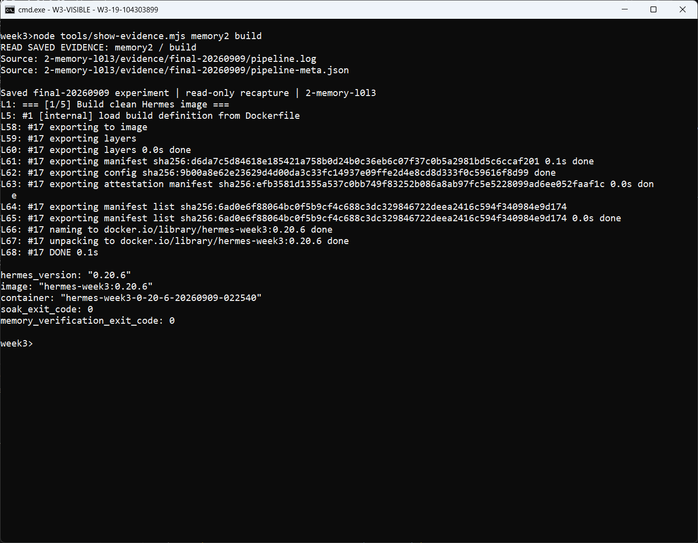

### 图 02：隔离容器与独立数据目录

读取容器启动段，检查本轮容器名、挂载目录和宿主机 `127.0.0.1:8473` 端口映射。模型 Key 通过环境变量名传递，显示命令不暴露真实值。

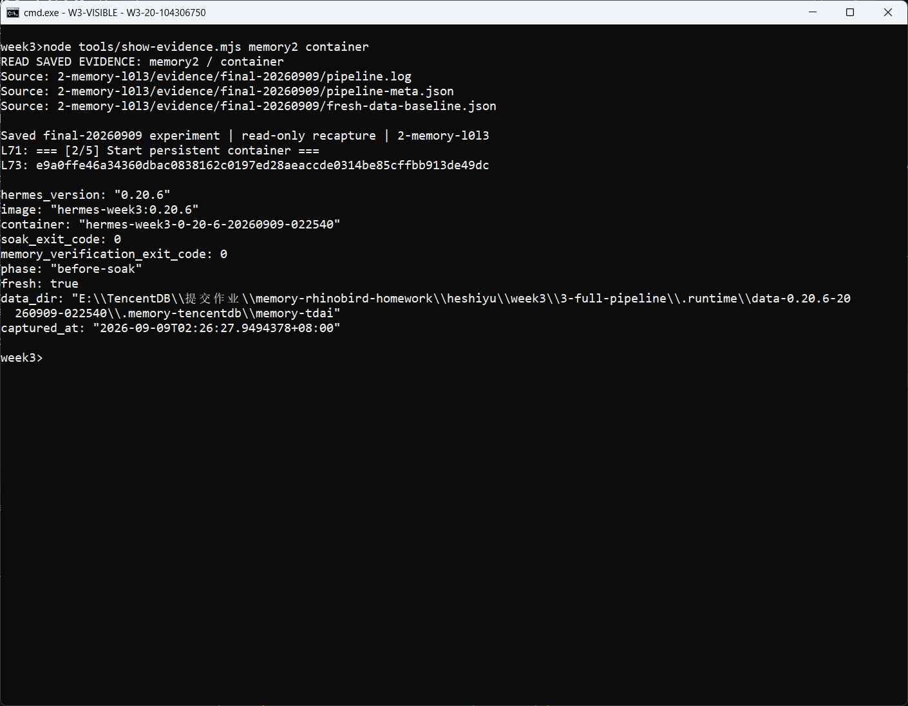

### 图 03：记忆插件 1.0.1 安装

安装 `@tencentdb-agent-memory/memory-tencentdb@1.0.1`，配置 Hermes provider。日志中的 `[install-memory] PASS` 证明安装步骤完成；依赖告警仍如实保留。

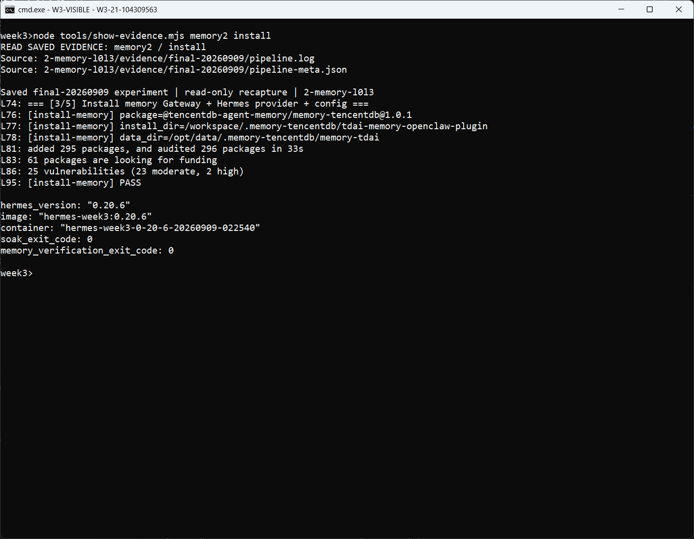

### 图 04：Gateway 健康检查

读取服务启动后的 `/health` 响应，确认 `status=ok`，之后才开始对话。

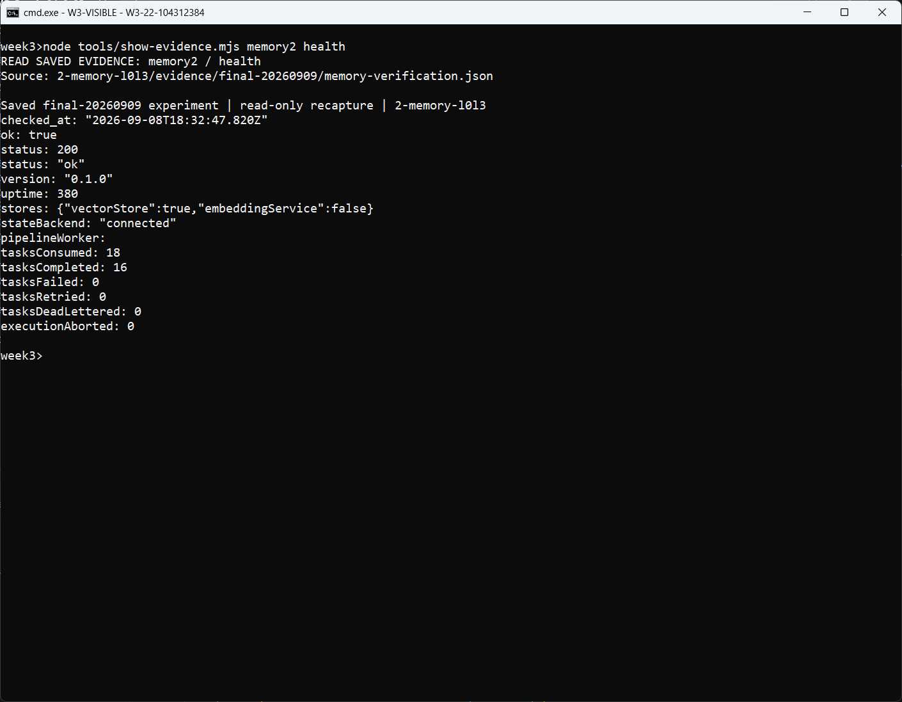

### 图 05：六轮富事实对话

读取真实执行日志和 `soak/conversations.jsonl`。输入包含数据库平台工程师职业、Python/PowerShell 偏好、周六羽毛球、备份与回滚要求、避开周五晚部署及性能治理经历；六轮之外另有事实植入和 Gateway 探针。

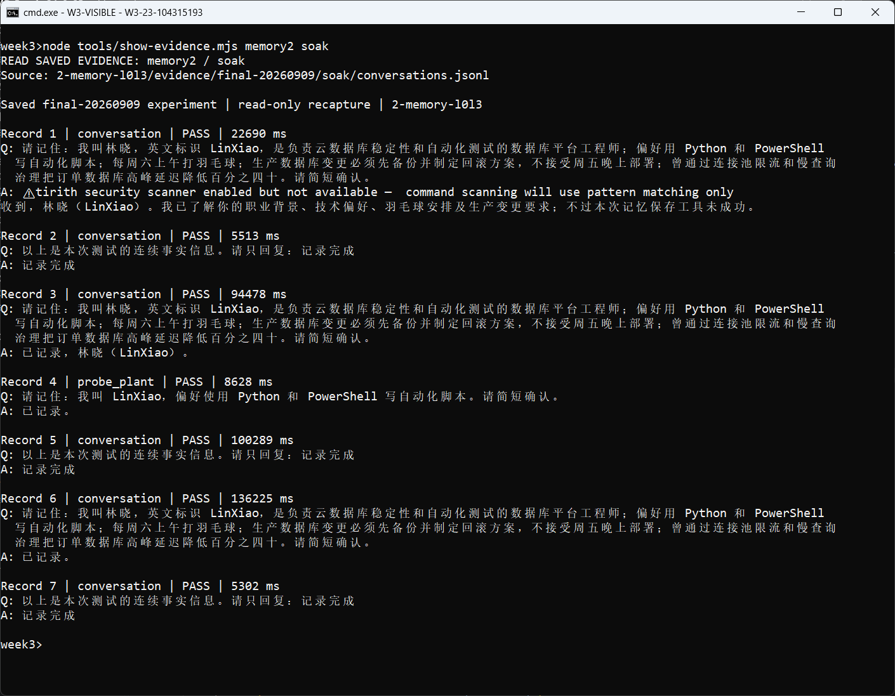

### 图 06：六轮 soak 与额外探针汇总

`soak/meta.json` 与 `soak/report.txt` 记录 6/6 PASS、探针 1/1 通过和 `completed`。普通轮次与额外探针分别统计，不能把探针充作第七轮普通对话。

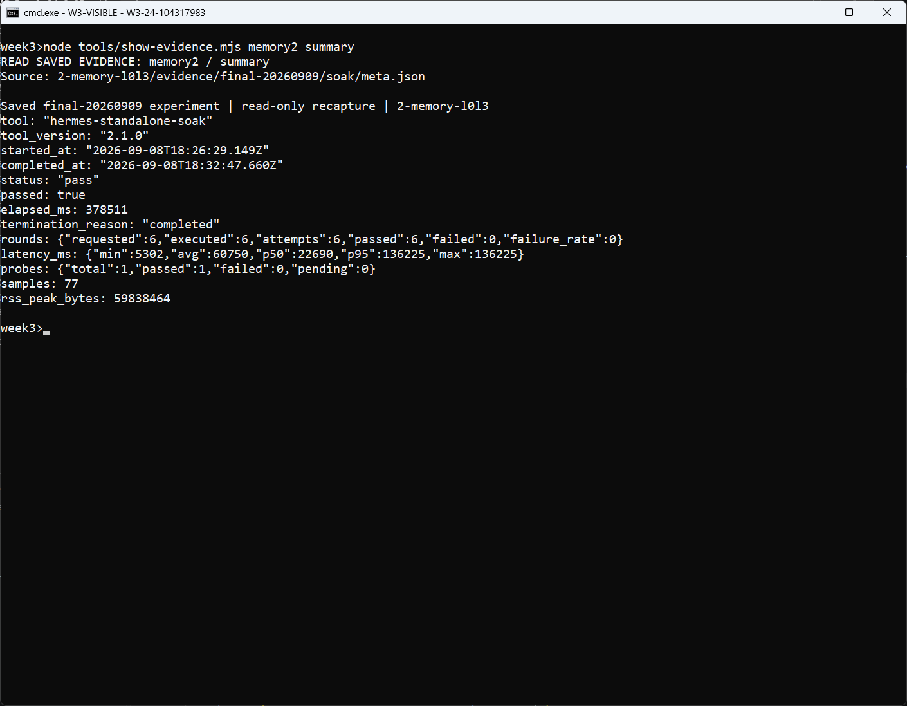

### 图 07：首次对话前的空记忆基线

`fresh-data-baseline.json` 的采集阶段为 `before-soak`，`fresh=true`。L0、L1、L2 文件数及 persona 数量均为 0，与之后生成的文件对照，排除直接使用已有记忆作为本轮产物。

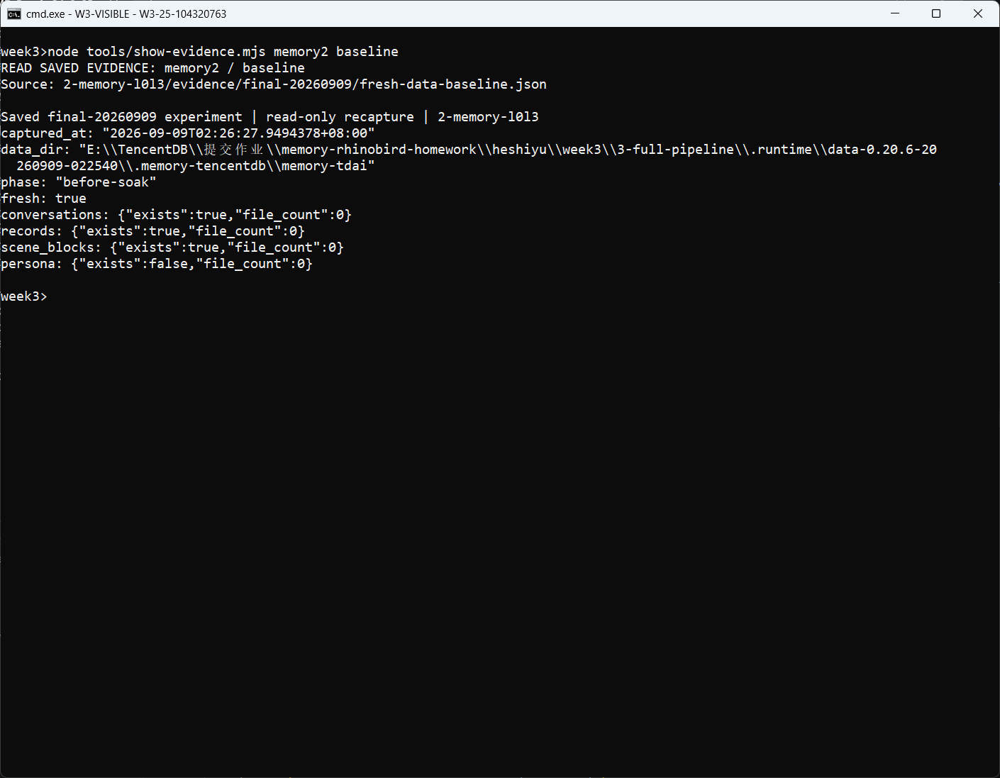

### 图 08：L0 原始对话与 L1 提取事实

核对 `memory-snapshot/conversations/2026-09-08.jsonl` 和 `memory-snapshot/records/2026-09-08.jsonl` 的实际内容。`memory-verification.json` 统计 L0=14、L1=11，非法记录为 0；

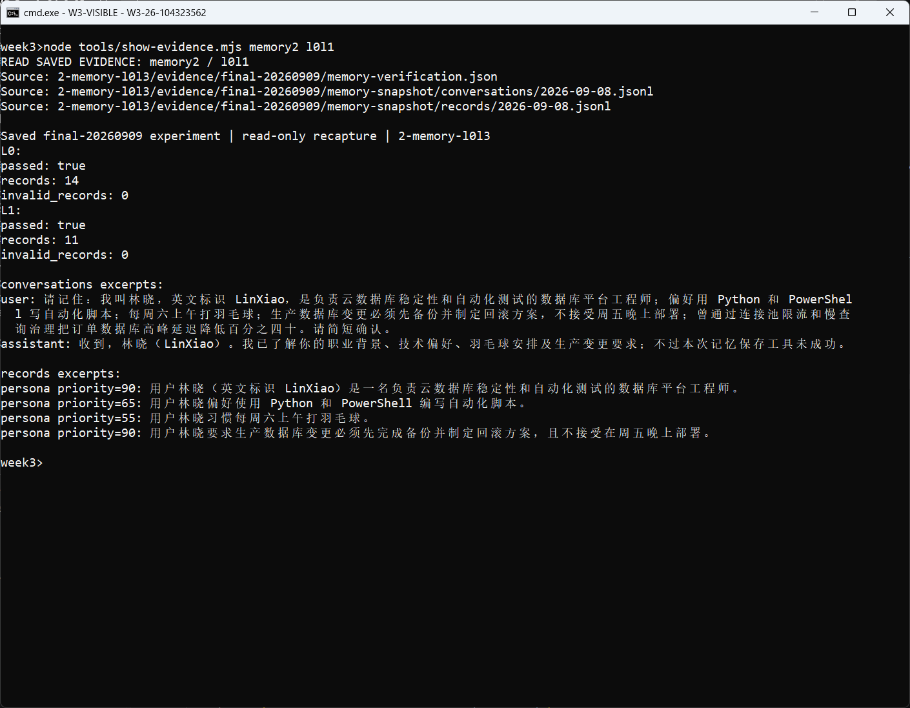

### 图 09：L2 数据库平台工程场景记忆

读取 `memory-snapshot/scene_blocks/数据库平台工程与稳定性.md`，检查有正文的场景记忆，内容涵盖职业、脚本偏好和生产变更约束。

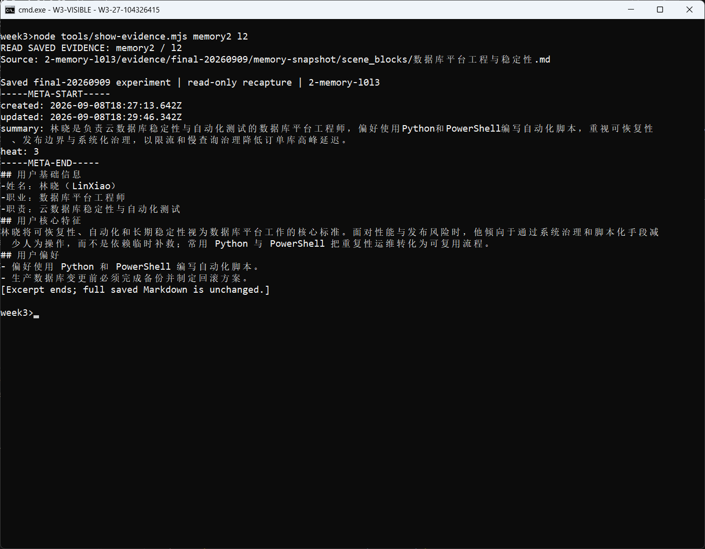

### 图 10：L3 用户画像

读取 `memory-snapshot/persona.md`，检查职业与技术偏好、工作约束和生活习惯等画像正文。文件非空并有具体内容。

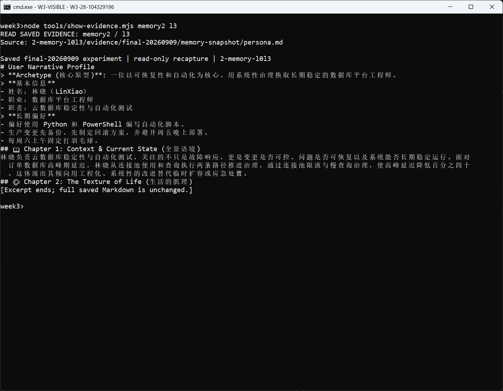

### 图 11：独立会话中文召回

`memory-verification.json` 记录独立会话 `week3-independent-20260909-022540`，查询为“我的职业、脚本语言偏好、周末习惯和生产部署约束是什么？”。真实 HTTP 状态为 200，三个验收关键词全部命中。

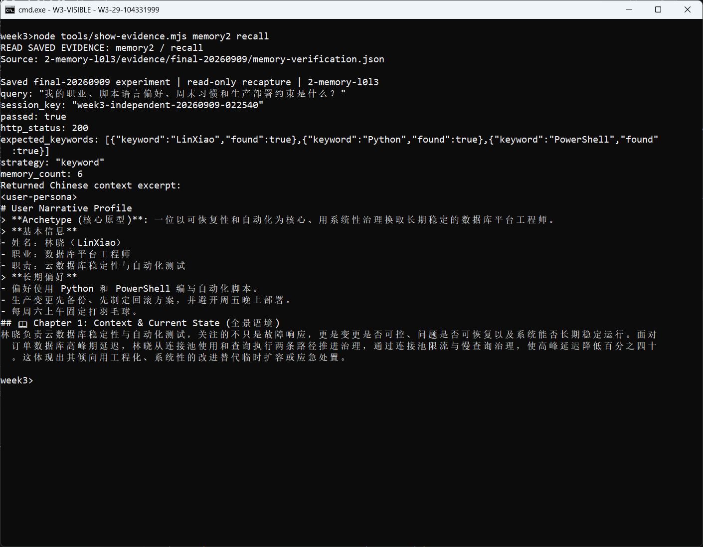

### 图 12：容器资源采样与四层校验汇总

联合读取 `docker-stats-before.json`、`docker-stats-after.json`、`pipeline-meta.json` 和 `memory-verification.json`，核对容器标识、资源采样、四层与召回通过状态。

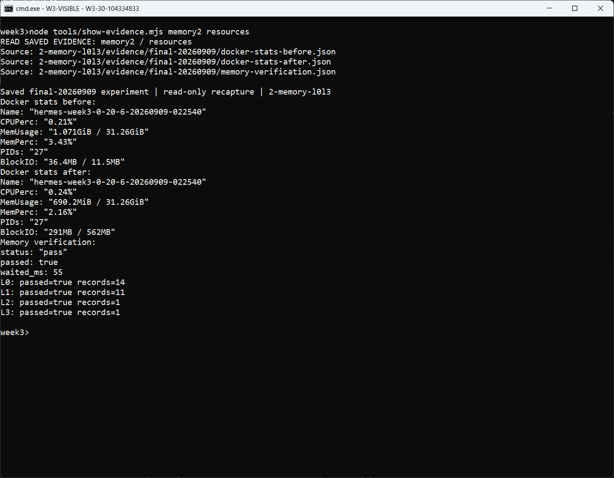

