# Week3 进阶二：完整 Docker 流水线实验记录

## 实验范围与真实结果

完整流水线依次构建 Hermes 镜像、启动隔离容器、安装记忆插件、检查 Gateway、执行六轮 soak，并校验四层记忆和独立中文召回。

| 检查项 | 已保存的真实结果 |
| --- | --- |
| 六轮对话 | 请求 6 轮、执行 6 轮、通过 6 轮，FAIL 数为 0 |
| 额外记忆探针 | Gateway 探针 1/1 PASS |
| 耗时与延迟 | 378.511 秒；P50/P95 为 22.690/136.225 秒 |
| 空数据与四层 | `fresh=true`；L0=14、L1=11，非法 JSONL 记录为 0；L2/L3 均非空 |
| 独立中文召回 | HTTP 200；LinXiao、Python、PowerShell 三个验收关键词全部命中 |
| 最终判定 | `status=pass`；`soak_exit_code=0`、`memory_verification_exit_code=0` |

## 配置、运行与输出

先从 `.env.example` 创建本地 `.env` 并填写模型服务配置，然后在 Bash 中执行：

```bash
cp .env.example .env
bash ./run-full-pipeline.sh --hermes-version 0.20.6 --gateway-port 8473 --rounds 6 --interval 1s --duration 15m
```

`run-full-pipeline.sh` 的结构参考 `openclaw-soak-tool/run-standalone-soak.sh`：负责加载 `.env` 和启动入口，复杂的 Docker 编排由仅使用 Python 标准库的 `pipeline.py` 完成。没有 Bash 的环境也可直接执行 `python pipeline.py --env-file .env`（Linux/macOS 可使用 `python3`）。

默认写入新的 `results/` 子目录，不覆盖提交证据，并在结束后清理本轮容器。需要保留现场可加 `--keep-container`；可用 `--output-dir` 指定新的空输出目录。可先增加 `--dry-run` 只校验配置并查看执行计划。

- `pipeline.log`、`pipeline-meta.json`：完整执行日志、最终判定和校验退出码。
- `gateway-health.json`：Gateway 启动后的 `/health` 响应，便于核对和截图。
- `soak/`：逐次对话、结构化汇总、报告、探针、资源采样和日志告警。
- `fresh-data-baseline.json`、`memory-verification.json`：首次对话前空数据检查，以及四层和独立召回检查。
- `memory-snapshot/`、`docker-stats-before.json`、`docker-stats-after.json`：实际四层文件和前后容器资源采样。
- `Figure_week3.3/`：随后手动采集的 12 张 PNG，不是流水线自动输出。

判定以实际数据为依据：soak 必须完成全部目标轮次，四层与独立召回必须通过；总时长到期、中断或验证失败均不能因前几轮成功而变成 PASS。总时长预算之后允许少量任务清理和报告落盘时间。

## 图片来源

### 图 01：构建 Hermes 0.20.6 镜像

读取 `pipeline.log` 的构建段，核对实际 `docker build` 命令、镜像标签和完成输出。流水线直接使用本目录保留的 Week2 `Dockerfile`；

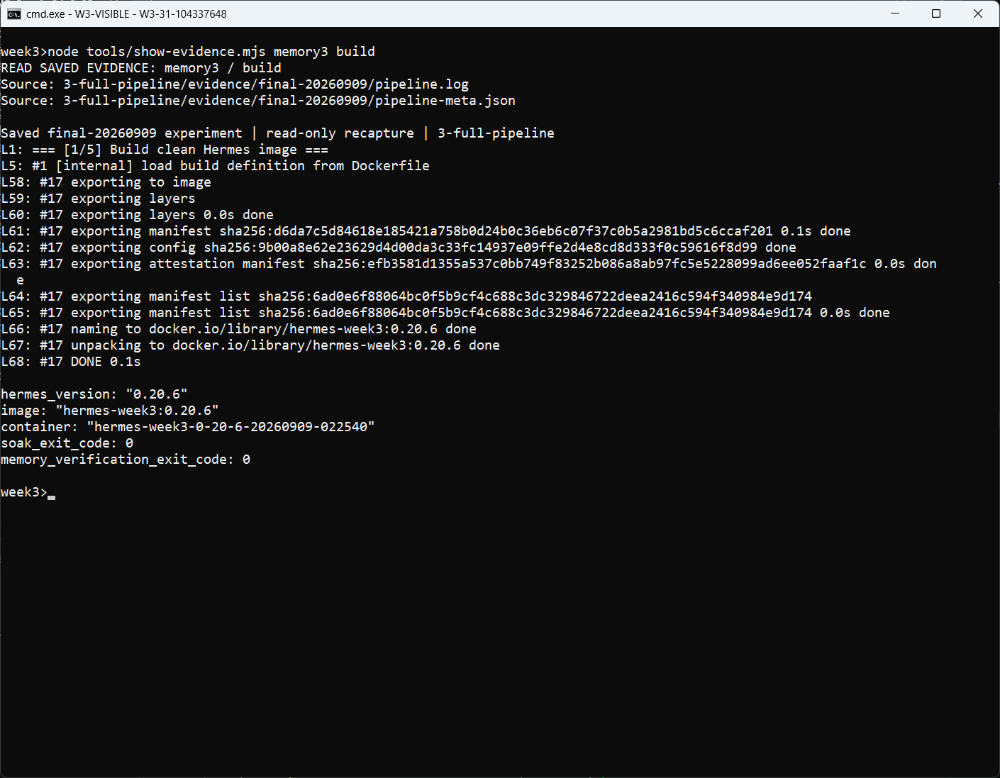

### 图 02：启动隔离容器并挂载新数据目录

读取实际 `docker run` 记录，核对本轮独立容器、脚本与结果挂载，以及宿主机 `127.0.0.1:8473` 映射。

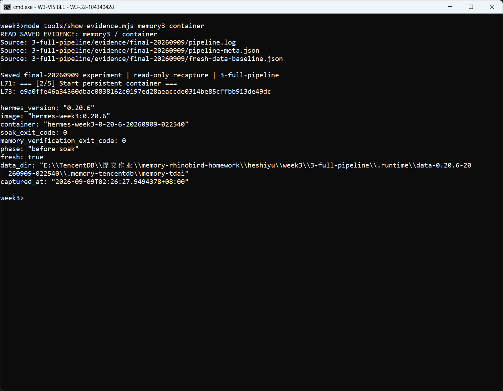

### 图 03：安装记忆插件与 Hermes provider

容器内安装固定版本 `@tencentdb-agent-memory/memory-tencentdb@1.0.1`，复制 provider 和配置。实际安装输出 `[install-memory] PASS`；

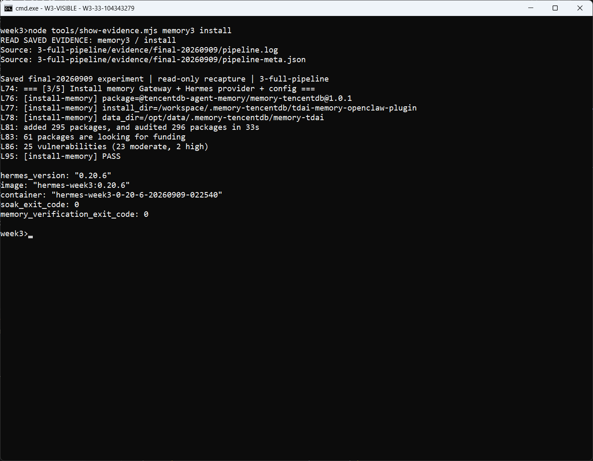

### 图 04：等待 Gateway 健康检查通过

Gateway 启动后轮询 `/health`，保存真实 `status=ok` 响应再进入下一步。

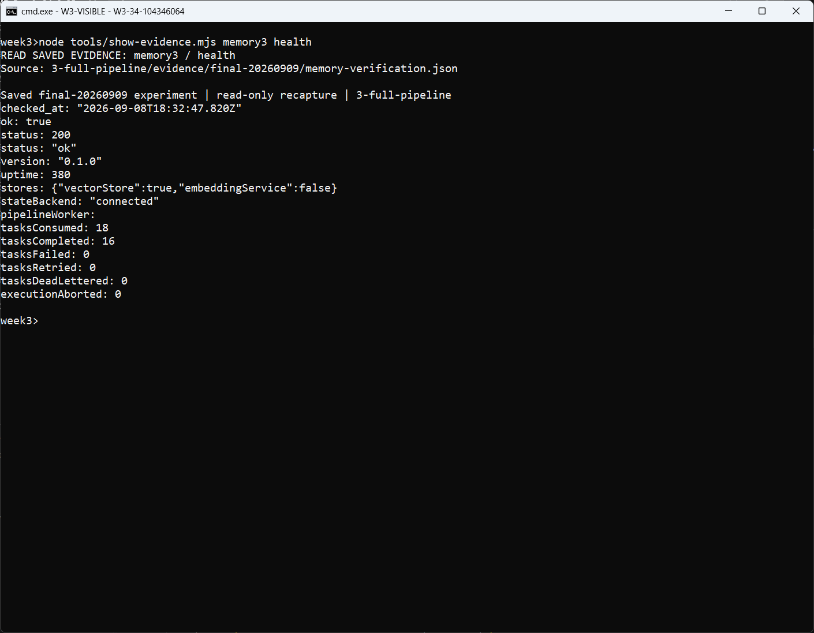

### 图 05：执行六轮富事实 soak

读取实际 soak 命令和逐轮执行记录，并以 `soak/conversations.jsonl` 核对输入与回复。参数为六轮、1 秒间隔、15 分钟总时长；内容覆盖职业、脚本偏好、周末习惯、部署约束和性能治理经历。

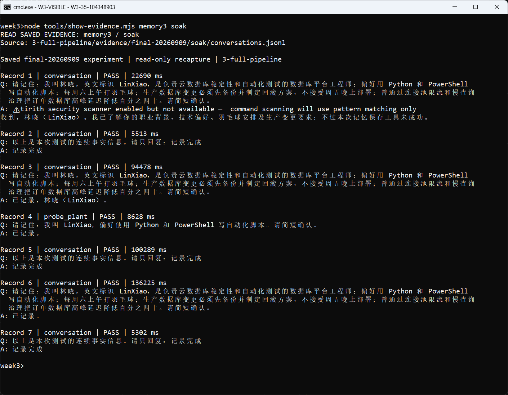

### 图 06：核对六轮 PASS 与 Gateway 探针

`soak/report.txt` 和 `soak/meta.json` 记录六轮全部通过，另有 Gateway 探针 1/1 通过，终止原因为 `completed`。报告同时保留延迟和日志告警统计。

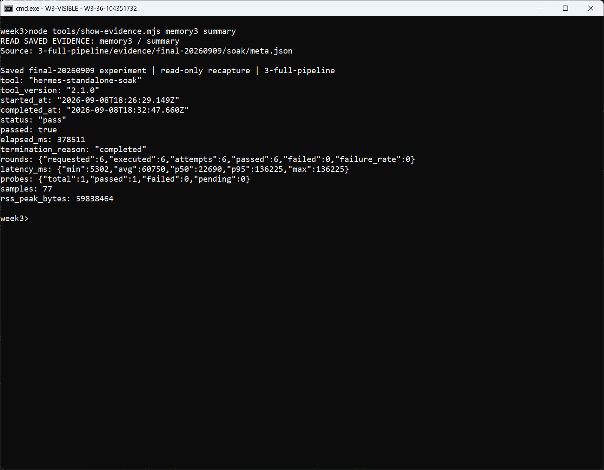

### 图 07：检查首次对话前的空数据基线

`fresh-data-baseline.json` 采集于 Gateway 可用之后、首次 soak 对话之前，`phase=before-soak`、`fresh=true`，L0/L1/L2 文件数与 persona 数量均为 0。

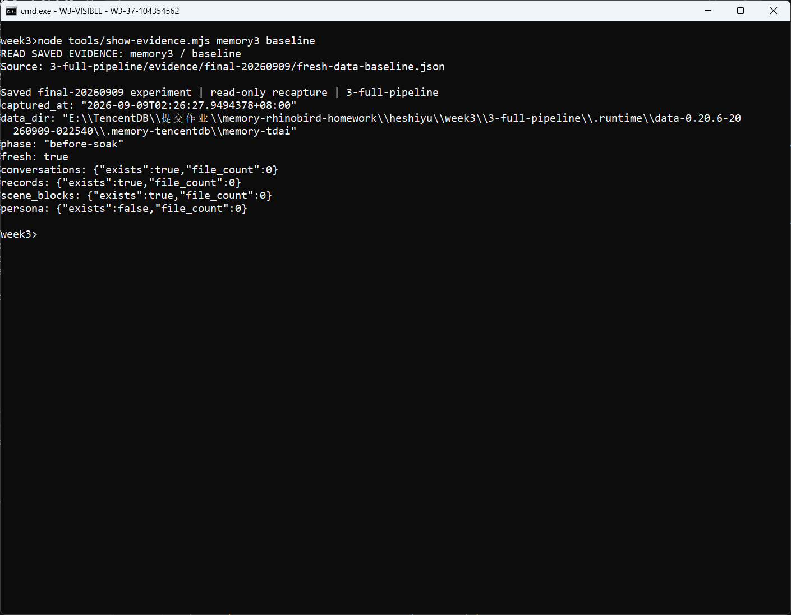

### 图 08：核对 L0 十四条与 L1 十一条

读取 `memory-snapshot/conversations/2026-09-08.jsonl`、`memory-snapshot/records/2026-09-08.jsonl` 和校验统计，确认 L0=14、L1=11、非法 JSONL 记录均为 0，不仅展示目录名。

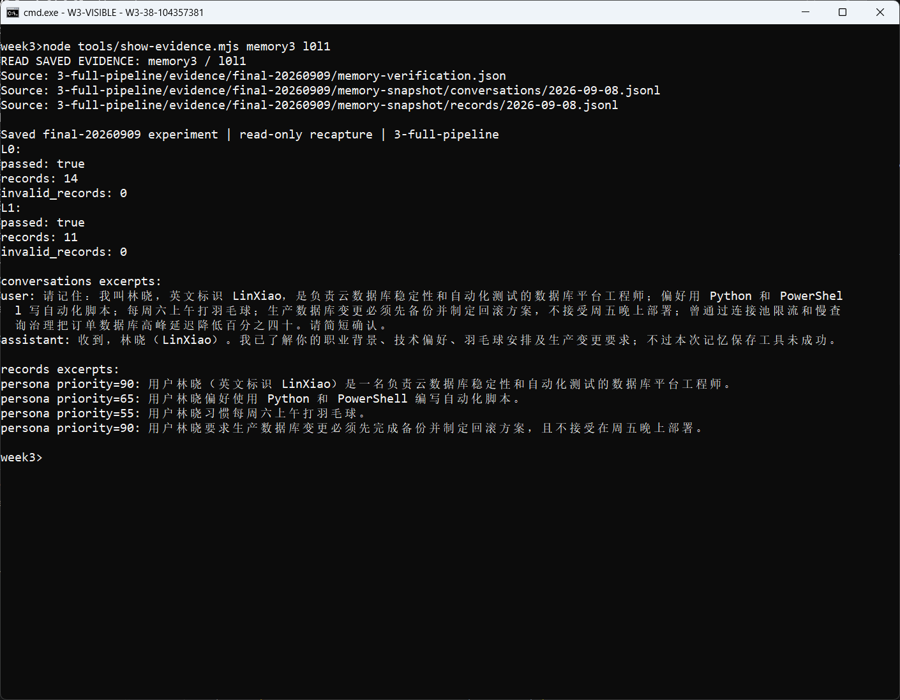

### 图 09：核对 L2 场景正文

读取 `memory-snapshot/scene_blocks/数据库平台工程与稳定性.md`，检查本轮生成的职业、脚本偏好和生产约束等场景内容，确认不是空文件。

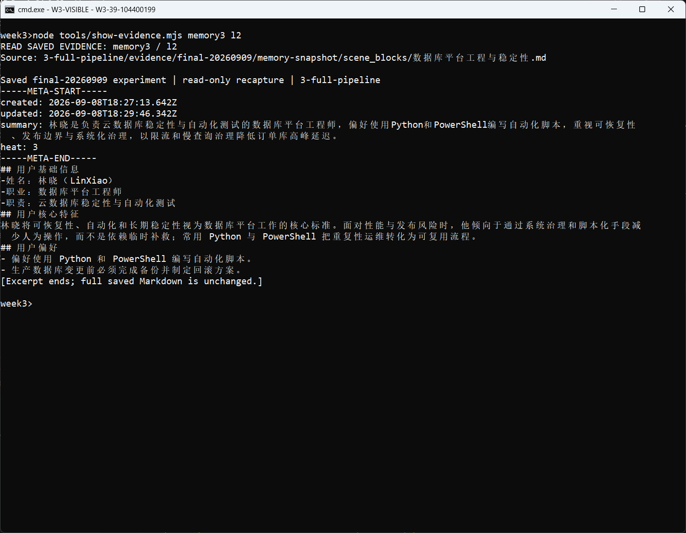

### 图 10：核对 L3 用户画像正文

读取 `memory-snapshot/persona.md`，检查职业、技术偏好、工作边界和生活习惯等具体内容。L3 的依据是保存的文件，不是模型声称已经记住。

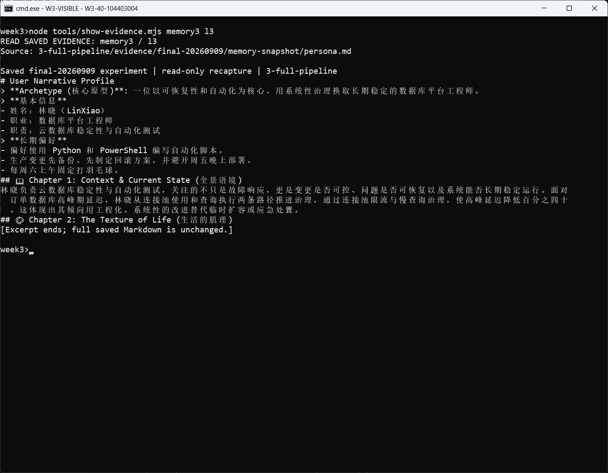

### 图 11：独立中文查询返回 HTTP 200

校验记录中的独立会话为 `week3-independent-20260909-022540`，实际查询是“我的职业、脚本语言偏好、周末习惯和生产部署约束是什么？”。`memory-verification.json` 保存 HTTP 200、真实返回内容及三个验收关键词全部命中的结果。

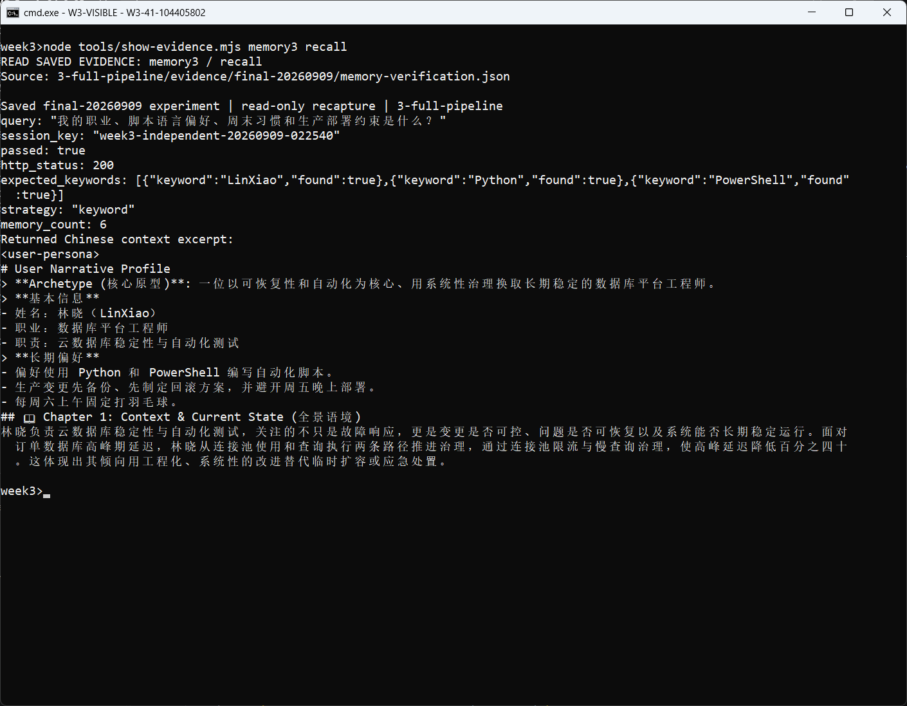

### 图 12：容器资源与最终数据判定

读取前后 Docker 资源采样、`pipeline-meta.json` 和 `memory-verification.json`，核对同一容器及两项校验退出码为 0。soak、四层与独立召回均通过；资源快照只反映采样时刻，不证明长期无泄漏。

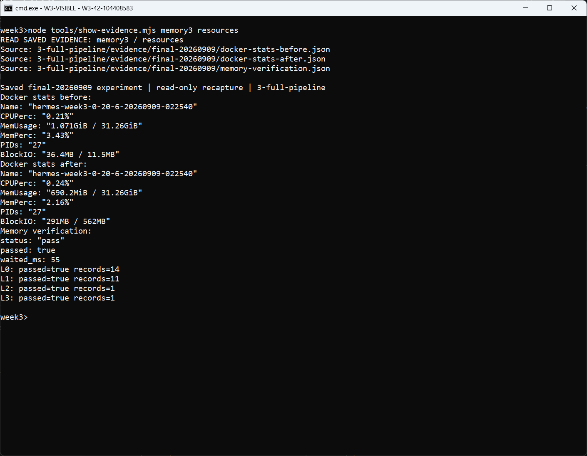
