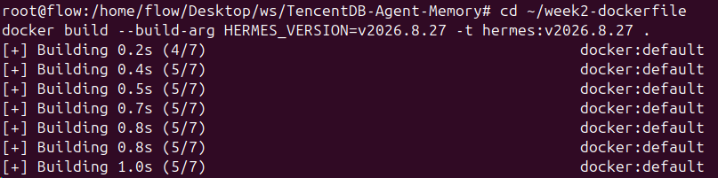
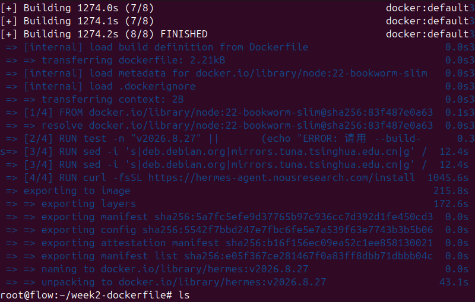
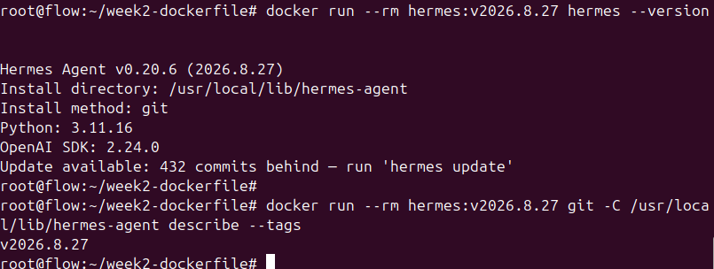
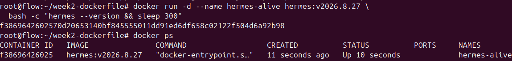
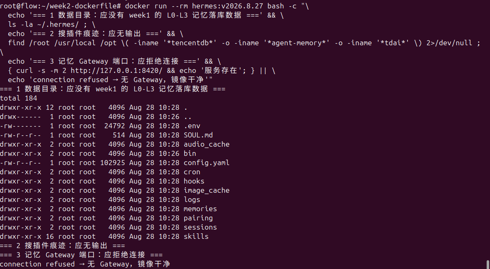
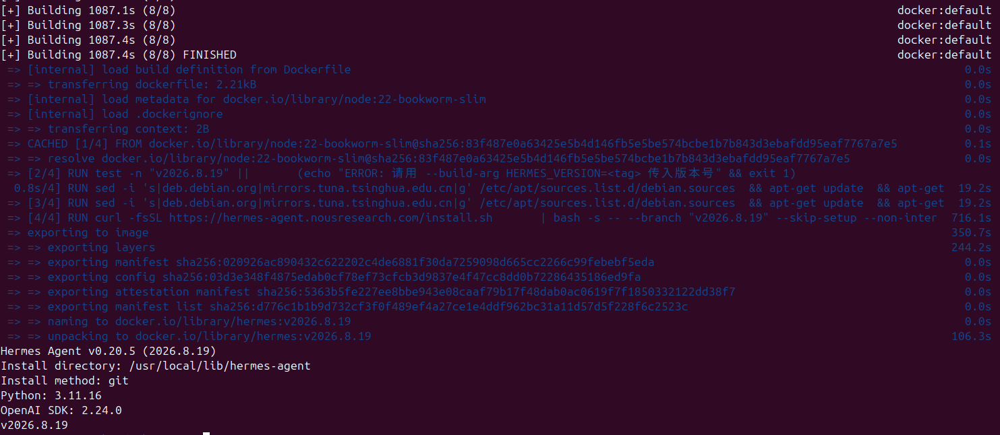

# Week2 作业：按版本号构建 Hermes 干净镜像（交付物 A）

**目标**：输入一个 Hermes 版本号，`docker build` 出一台装好该版本 Hermes 的干净机器（不含记忆插件，不 COPY 本仓库源码，预装 Node.js ≥ 22.16.0）。

- 基础镜像：`node:22-bookworm-slim`（Node 22 + Debian 12 bookworm 精简版）
- 运行环境：VMware Workstation 中的 Ubuntu 24.04 虚拟机，Docker Engine（apt 官方源安装）

---

## 一、Dockerfile

```dockerfile
# ============================================================
# Week2 交付物 A：按版本号构建 Hermes 干净镜像
# 构建命令：
#   docker build --build-arg HERMES_VERSION=v2026.8.27 -t hermes:v2026.8.27 .
# ============================================================

# 1 基础镜像：Node 22 + Debian 12(bookworm) 精简版
#    同时满足"预装 Node >= 22.16.0"（记忆插件 Gateway 的运行依赖）
FROM node:22-bookworm-slim

# 2 版本号参数化：不写死版本，构建时用 --build-arg 传入
#    Hermes 的 git tag 是日期式（如 v2026.8.27），语义化版本（v0.20.6）只出现在
#    Release 标题里，git 仓库中不存在 v0.20.6 这个 tag，因此本参数传日期式 tag
ARG HERMES_VERSION

# 3 忘了传参就直接报错终止，而不是装出个错误镜像
RUN test -n "$HERMES_VERSION" || \
      (echo "ERROR: 请用 --build-arg HERMES_VERSION=<tag> 传入版本号" && exit 1)

# 4 把版本号转成运行期环境变量，容器跑起来后 echo $HERMES_VERSION 也能看到
ENV HERMES_VERSION=${HERMES_VERSION}

# 5 装系统工具 + 换国内源：
#    slim 镜像没有 curl/git，而官方 install.sh 需要 git clone 和下载 uv，必须补上
RUN sed -i 's|deb.debian.org|mirrors.tuna.tsinghua.edu.cn|g' /etc/apt/sources.list.d/debian.sources \
 && apt-get update \
 && apt-get install -y --no-install-recommends ca-certificates curl git \
 && rm -rf /var/lib/apt/lists/*

# 6 给 uv 装 Python 依赖时走 TUNA 的 PyPI 镜像（国内加速）
ENV UV_DEFAULT_INDEX=https://pypi.tuna.tsinghua.edu.cn/simple

# 7 核心：安装指定版本的 Hermes
#    官方 install.sh 内部就是 git clone --branch <tag> + uv 安装；
#    --skip-setup --non-interactive 跳过交互式配置向导（构建环境无法交互）；
#    容器内以 root 安装，装完后：命令在 /usr/local/bin/hermes，代码在 /usr/local/lib/hermes-agent
RUN curl -fsSL https://hermes-agent.nousresearch.com/install.sh \
      | bash -s -- --branch "${HERMES_VERSION}" --skip-setup --non-interactive

# 8 启动命令：默认进入 hermes 交互界面（配 docker run -it 使用）
CMD ["hermes"]
```

---

## 二、构建与验收命令

### 1. 构建（验收标准 1）

```bash
docker build --build-arg HERMES_VERSION=v2026.8.27 -t hermes:v2026.8.27 .
```





### 2. 验证版本一致（验收标准 2）

```bash
# 容器内查 hermes 版本
docker run --rm hermes:v2026.8.27 hermes --version
# 预期输出：Hermes Agent v0.20.6 (2026.8.27)

# 交叉核对 git tag（应显示传入的 v2026.8.27）
docker run --rm hermes:v2026.8.27 git -C /usr/local/lib/hermes-agent describe --tags
# 预期输出：v2026.8.27
```



### 3. 验证容器能启动、进程能跑（验收标准 3）

```bash
# 后台起容器：打印版本后保持存活 5 分钟
docker run -d --name hermes-alive hermes:v2026.8.27 \
  bash -c "hermes --version && sleep 300"

# 确认容器是 Up 状态、没退出
docker ps
```

> 说明：`hermes` 不带参数是交互界面，后台模式无法直接常驻，故用 `sleep` 保持进程存活供检查；第三周交付的 soak 自动对话脚本将取代这里的 sleep。



### 4. 附带验证：镜像确实是"干净"的（无记忆插件）

硬要求 2 要求镜像不装记忆插件——最终工具的流程是"拉干净镜像 → 测试时现装插件 → 测兼容性"，插件预装了反而跑题。用 week1 中插件存在的三个证据（Gateway 进程 / 8420 端口 / L0-L3 落库数据）做反向检查：

```bash
docker run --rm hermes:v2026.8.27 bash -c "\
  echo '=== 1 数据目录：应没有 week1 的 L0-L3 记忆落库数据 ===' && \
  ls -la ~/.hermes/ ; \
  echo '=== 2 搜插件痕迹：应无输出 ===' && \
  find /root /usr/local /opt \( -iname '*tencentdb*' -o -iname '*agent-memory*' -o -iname '*tdai*' \) 2>/dev/null ; \
  echo '=== 3 记忆 Gateway 端口：应拒绝连接 ===' && \
  { curl -s -m 2 http://127.0.0.1:8420/ && echo '服务存在'; } || \
  echo 'connection refused → 无 Gateway，镜像干净'"
```

实测输出：① 数据目录无 week1 的 L0-L3 落库数据残留；② 插件痕迹搜索无输出；③ 8420 端口 connection refused → 镜像干净：



### 5. 参数化验证：换一个版本重建 v2026.8.19

为证明版本号真正参数化（而非恰好装上某个版本），换一个 tag 重复构建与验证：

```bash
docker build --build-arg HERMES_VERSION=v2026.8.19 -t hermes:v2026.8.19 .
docker run --rm hermes:v2026.8.19 hermes --version
docker run --rm hermes:v2026.8.19 git -C /usr/local/lib/hermes-agent describe --tags
```

实测：构建成功，容器内输出 `v0.20.5 (2026.8.19)`、tag 核验 `v2026.8.19`，与 v2026.8.27（v0.20.6）互为对照——两个版本连语义化版本号都不同，证明镜像内容随输入版本真实变化：



---

## 三、版本号约定

- `HERMES_VERSION` 传入 **日期式 git tag**（如 `v2026.8.27`）。Hermes 仓库的 tag 均为 `v年.月.日` 格式（部分带补丁号，如 `v2026.8.16.2`）；
- 容器内 `hermes --version` 显示的是 **语义化版本**（如 `v0.20.6`）；
- 两者的对应关系在 [GitHub Releases](https://github.com/NousResearch/hermes-agent/releases) 每条标题里，如 "Hermes Agent v0.20.6 (2026.8.27)"；
- 因此验收标准 2 的"镜像内版本 = 输入版本"体现为：输入 `v2026.8.27` → 容器内输出 `v0.20.6 (2026.8.27)`，日期部分一一对应。

---

## 四、踩坑记录

1. **slim 镜像没有 curl/git**：`node:22-bookworm-slim` 是精简版，构建时直接 `curl install.sh` 会报 `curl: command not found`，必须先 `apt-get install` 补上 `curl`、`git`、`ca-certificates`。
2. **install.sh 必须加 `--skip-setup --non-interactive`**：官方脚本默认装完跑交互式配置向导，`docker build` 环境没有键盘输入，不加参数构建会卡死/中断。
3. **`0.x.x` 不能直接当版本传**：会议示例写的 `HERMES_VERSION=0.x.x` 形式在 git 仓库中没有对应 tag，直接传会 clone 失败；实际能传的是日期式 tag（见「版本号约定」）。
4. **装完后 `hermes --version` 提示 "Update available: N commits behind" 是正常现象**：这恰好证明版本被钉住而不是最新版；此时**不要**执行 `hermes update`，否则版本一致性验收会被破坏。
5. **安装层耗时长是正常的**：install.sh 要从 GitHub 拉源码并用 uv 安装 Python 依赖，首次构建该层约 15-20 分钟；`ARG`/`ENV` 行不产生构建步骤，日志里只有 FROM + 3 条 RUN 属正常。

---

## 五、已知限制

- 镜像**不含** TencentDB-Agent-Memory 记忆插件（按硬要求 2，插件由第三周 soak 工具在测试时安装）；
- 已验证版本：
  - [x] `v2026.8.27`（构建、版本一致性、容器启动三项验收均通过；容器内 `hermes --version` = v0.20.6）
  - [x] `v2026.8.19`（同三项验收均通过；容器内 `hermes --version` = v0.20.5——两个版本连语义化版本号都不同，进一步证明镜像内容随输入版本真实变化）
- 镜像内 apt/PyPI 使用清华 TUNA 国内源加速，海外环境使用时可将第 5、6 步的换源行删除。
