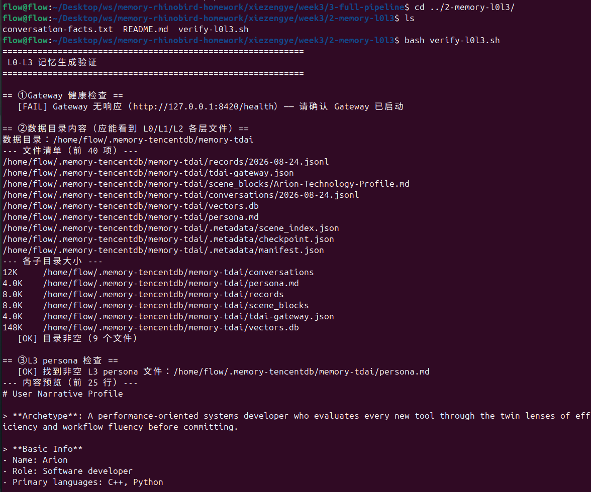
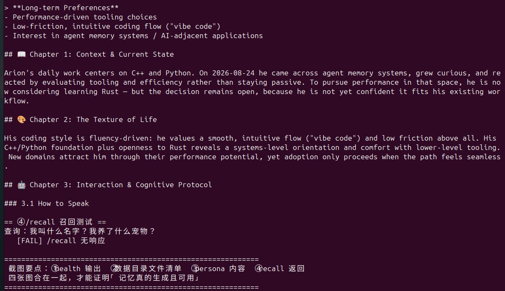

# Week3 作业：Hermes soak 自动对话脚本（总览）

三个目录对应三个层级（会议对齐的目录名规范）：

| 目录 | 层级 | 是否必交 | 内容 |
|---|---|---|---|
| `1-basic-soak/` | 基础：soak 自动对话脚本 | **必交** | `soak.mjs`（零依赖 Node）+ 闲聊剧本 + 一键运行脚本 |
| `2-memory-l0l3/` | 进阶 1：记忆插件下 L0-L3 生成 + 截图证明 | **必交** | 事实剧本 + 四合一验证脚本（`verify-l0l3.sh`） |
| `3-full-pipeline/` | 进阶 2：Dockerfile + soak 一键流水线 | 选交 | `run-pipeline.sh`（build→run→装插件→Gateway→soak→验证） |

## 快速开始（在装好 Docker 的 Linux 虚拟机里）

```bash
git pull
cd memory-rhinobird-homework/xiezengye/week3

# 基础：跑 10 轮闲聊 soak，出结构化 JSON（约 5-10 分钟）
cd 1-basic-soak
MODEL_API_KEY=你的key MODEL_BASE_URL=https://api.deepseek.com MODEL_NAME=deepseek-v4-flash bash run-basic.sh


# 演示异常容错：故意给错 Key → 应报 fail 而不是假通过（截图用）
MODEL_API_KEY=sk-invalid MODEL_BASE_URL=https://... MODEL_NAME=... bash run-basic.sh

# 进阶 1 + 进阶 2：一键流水线（build→装插件→Gateway→跑事实剧本→验证 L0-L3）
cd ../3-full-pipeline
MODEL_API_KEY=sk-xxxx MODEL_BASE_URL=https://... MODEL_NAME=... bash run-pipeline.sh
```

三个模型环境变量（`MODEL_API_KEY` / `MODEL_BASE_URL` / `MODEL_NAME`）用第一周对话时的那家即可。

## 各层验收对照

| 验收标准 | 满足方式 |
|---|---|
| 基础 1：自动完成 N 轮对话并输出结构化 JSON | `results-<时间戳>/result.json` + 终端截图 |
| 基础 2：轮次/间隔/总时长三参数都生效 | `SOAK_ROUNDS` / `SOAK_INTERVAL` / `SOAK_MAX_TOTAL_SECONDS`，改小数值各跑一次截图对比 |
| 基础 3：结果明确 pass/fail，含轮次、耗时统计 | `result.json` 的 `passed`、`rounds`、`stats`（avg/p50/p95） |
| 基础 4：至少演示一种异常容错 | 错误 API Key → 401 报错回复识别 → 熔断 → fail（见 1-basic-soak/README.md「演示异常容错」） |
| 进阶 1：基于第二周 Dockerfile + 装记忆插件 + 事实剧本 + L0-L3 截图 | `run-pipeline.sh` 跑完后 `verify-l0l3.sh` 四合一输出截图 |
| 进阶 2：一键跑通全流程 + JSON 结果 + L0-L3 截图 | `run-pipeline.sh` 全自动完成 5 步 |

## 交付物截图清单（拍照顺序建议）

1. 基础 soak 终端（逐轮 ✓/✗ 进度 + 最终 PASSED）
2. `results-<时间戳>/result.json` 内容（passed: true + 统计）
3. 三参数生效的对比（改 rounds/interval/max-total 各一次）
4. 错误 API Key 的 `result.json`（passed: false, circuit_breaker, 401 明细）
5. 进阶：`verify-l0l3.sh` 四合一输出（health / 数据目录 / persona / recall 四段）
6. 流水线全流程终端记录（5 步日志）

## 注意事项（重要）

1. **版本号用日期式 tag**（`v2026.8.27`），第二周已验证的约定；
2. **`hermes -z` 每轮一个独立进程**，单轮几秒到几十秒正常，别以为是卡死；
3. **L1/L2/L3 记忆是异步沉淀**，soak 跑完等 1-2 分钟再验证/截图；
4. **国内网络**：容器内拉插件源码慢/失败时用 `GIT_PROXY_ARGS` 和 `NPM_REGISTRY`（见 3-full-pipeline/README.md）；
5. 凭证只走环境变量，截图时**记得打码 API Key**；
6. 脚本均为 LF 换行的 bash/Node 文件，在 Linux 虚拟机直接运行即可，不要在 Windows 里改行尾。
