# Week3 验收文档：Hermes soak 自动对话脚本

> 作业：给 Hermes 写一个「自己跟自己聊很多轮」的 soak 自动对话脚本，输出 pass/fail 结构化 JSON；
> 进阶：在装好记忆插件的 Hermes 上跑富含事实的剧本，让 L0-L3 四层记忆真正落库。
> 环境：Ubuntu 24.04 虚拟机 + Docker；模型：DeepSeek（api.deepseek.com / deepseek-v4-flash）。

## 一、快速开始（复现步骤）

```bash
git pull
cd memory-rhinobird-homework/xiezengye/week3

# 基础：跑 10 轮闲聊 soak，出结构化 JSON（约 5-10 分钟）
cd 1-basic-soak
MODEL_API_KEY=你的key MODEL_BASE_URL=https://api.deepseek.com MODEL_NAME=deepseek-v4-flash bash run-basic.sh

# 演示异常容错：故意给错 Key → 应报 fail 而不是假通过（截图用）
MODEL_API_KEY=sk-invalid MODEL_BASE_URL=https://api.deepseek.com MODEL_NAME=deepseek-v4-flash bash run-basic.sh

# 进阶 1 + 进阶 2：一键流水线（build→装插件→Gateway→跑事实剧本→验证 L0-L3，约 40 分钟）
cd ../3-full-pipeline
MODEL_API_KEY=你的key MODEL_BASE_URL=https://api.deepseek.com MODEL_NAME=deepseek-v4-flash bash run-pipeline.sh
```

三个模型环境变量（`MODEL_API_KEY` / `MODEL_BASE_URL` / `MODEL_NAME`）用第一周对话时的那家即可。
每次运行的容器名与结果目录自动带时间戳（`hermes-week3-basic-20260902-175512` / `results-20260902-175512/`），
多终端并行、重复运行互不干扰，历史结果不会被覆盖。

## 二、验收标准对照

| 验收标准 | 满足方式 | 状态 |
| --- | --- | --- |
| 基础 1：自动完成 N 轮对话并输出结构化 JSON | `results-<时间戳>/result.json` + 终端截图 | ☑ 已通过 |
| 基础 2：轮次/间隔/总时长三参数都生效 | `SOAK_ROUNDS` / `SOAK_INTERVAL` / `SOAK_MAX_TOTAL_SECONDS`，改小数值各跑一次截图对比 | ☑ 已通过 |
| 基础 3：结果明确 pass/fail，含轮次、耗时统计 | `result.json` 的 `passed`、`rounds`、`stats`（avg/p50/p95） | ☑ 已通过 |
| 基础 4：至少演示一种异常容错 | 错误 API Key → 触发 Connection error 3 次重试 → 熔断 → fail | ☑ 已通过 |
| 进阶 1：第二周 Dockerfile + 记忆插件 + 事实剧本 + L0-L3 截图 | `run-pipeline.sh` 跑完后 `verify-l0l3.sh` 四合一输出截图 | ☑ 已通过 |
| 进阶 2：一键跑通全流程 + JSON 结果 + L0-L3 截图 | `run-pipeline.sh` 全自动完成 5 步 | ☑ 已通过 |

## 三、验收记录（跑完后填写）

### 1. 基础 soak（闲聊剧本）

- 结果目录：`results-20260902-183318/`
- `result.json` 关键字段：

```json
{
  "tool": "hermes-soak",
  "tool_version": "1.0.0",
  "passed": true,
  "hermes_version": {
    "raw": "Hermes Agent v0.20.6 (2026.8.27)\nInstall directory: /usr/local/lib/hermes-agent\nInstall method: git\nPython: 3.11.16\nOpenAI SDK: 2.24.0",
    "release_date": "2026.8.27",
    "expected": "2026.8.27",
    "verified": true,
    "spawn_error": null
  },
  "config": {
    "hermes": "hermes",
    "rounds": 10,
    "interval_seconds": 5,
    "max_total_seconds": 600,
    "per_round_timeout_ms": 240000,
    "max_consecutive_failures": 3,
    "prompt": null,
    "conversation_file": "/opt/soak/conversation-chat.txt",
    "conversation_turns": 14,
    "expected_version": "v2026.8.27",
    "out_dir": "/opt/soak/out"
  },
  "rounds": {
    "total": 10,
    "executed": 10,
    "passed": 10,
    "failed": 0
  },
  "stats": {
    "total_duration_seconds": 112.64,
    "avg_round_ms": 6759,
    "p50_round_ms": 6192,
    "p95_round_ms": 16528,
    "min_round_ms": 4299,
    "max_round_ms": 16528
  },
  "failures": [],
  "termination_reason": "completed",
  "started_at": "2026-09-02T10:33:18.920Z",
  "completed_at": "2026-09-02T10:35:21.969Z"
}
```

- 截图 1：终端逐轮 ✓/✗ 进度 + 最终 PASSED
  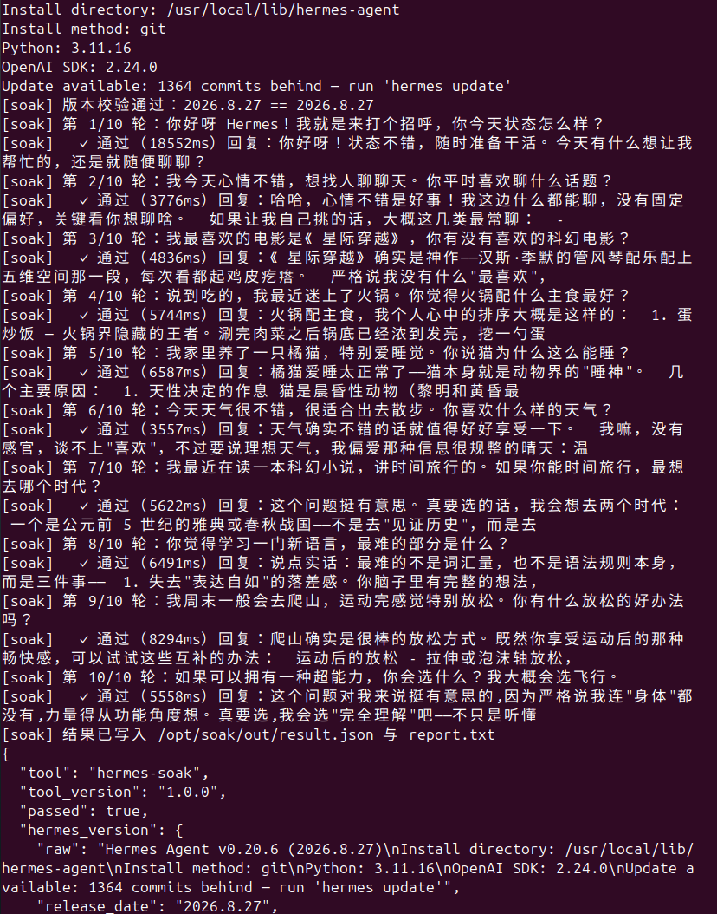
  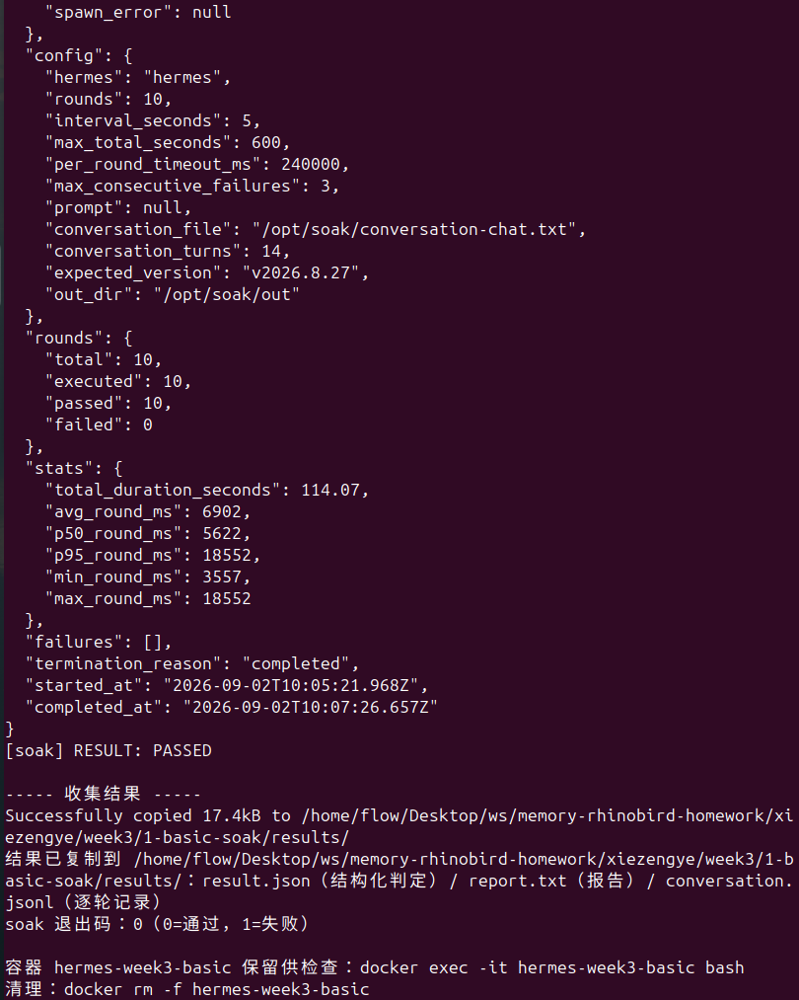
- 截图 2：`result.json` 内容
  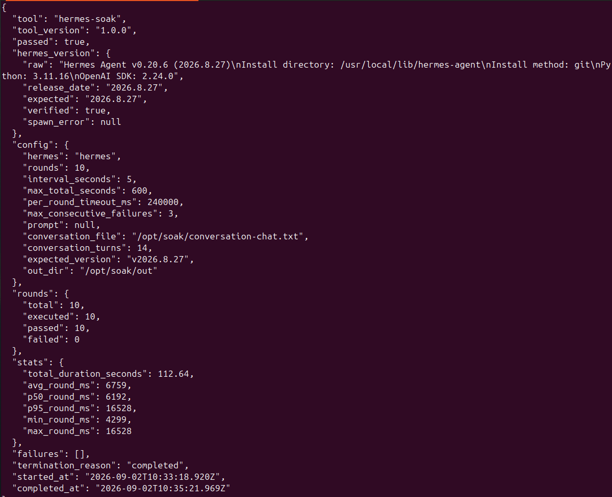

### 2. 三参数生效对比

> 三次跑都加 `SKIP_BUILD=1` 复用 `hermes:v2026.8.27` 镜像；只看 `rounds.executed`、`termination_reason`、`stats.total_duration_seconds` 三个字段即可证明参数生效。

| 参数 | A 轮次生效 | B 间隔生效 | C 总时长生效 |
| --- | --- | --- | --- |
| `SOAK_ROUNDS` | **3** | 3 | 20 |
| `SOAK_INTERVAL` | 5（默认） | **15** | 1 |
| `SOAK_MAX_TOTAL_SECONDS` | 600（默认） | 600（默认） | **30** |
| `rounds.executed` / `rounds.passed` / `rounds.failed` | 3 / 3 / 0 | 3 / 3 / 0 | 1 / 0 / 1 |
| `termination_reason` | `completed` | `completed` | `max_total_seconds_reached` |
| `stats.total_duration_seconds` | 44.04 | 61.78 | 240.94 |
| `result.passed` | true | true | false（未跑满） |
| 结果目录 | `results-20260902-201746` | `results-20260902-202551` | `results-20260902-211230` |
| 截图 | 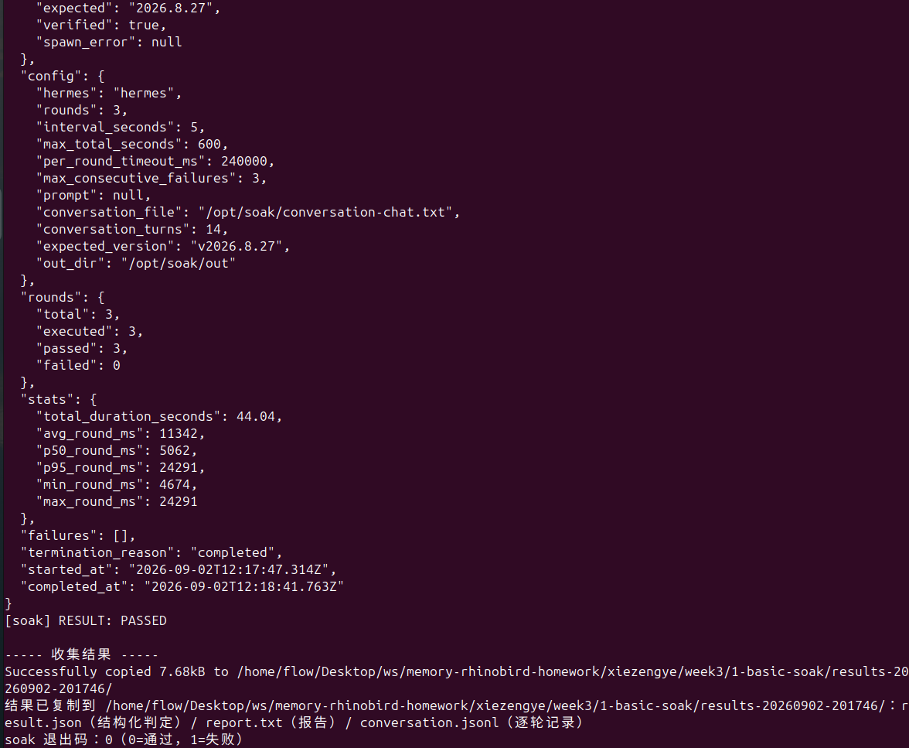 | 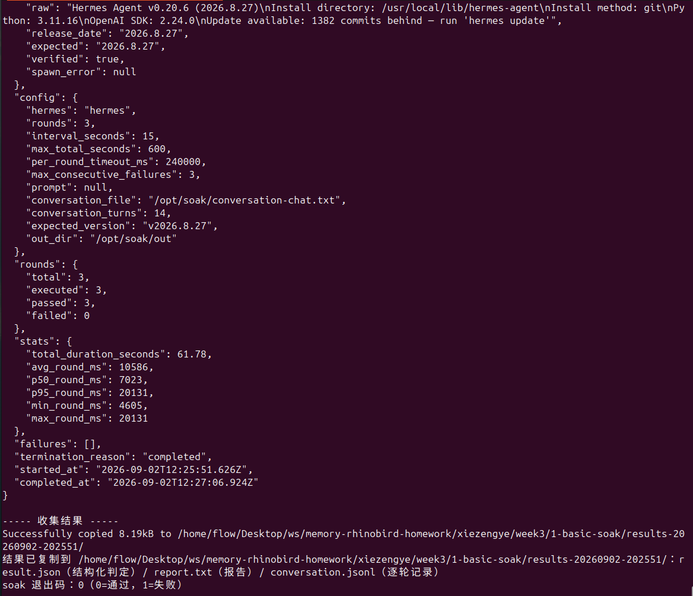 | 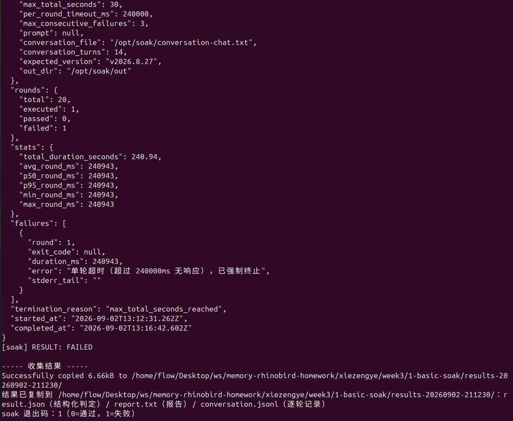 |

**结论**：
- **A**：轮次参数生效——`rounds.executed = 3 = SOAK_ROUNDS`，10 轮默认被压到 3 轮就正常结束（`completed`）。
- **B**：间隔参数生效——同样 3 轮，间隔从 5s 改 15s，总耗时从 44s 涨到 61s（多了约 18s ≈ 2 个间隔 × 10s）。
- **C**：总时长参数生效——`max_total=30` 远小于 per_round=240s，第 1 轮单轮超时与 max_total 同时命中，脚本以 `max_total_seconds_reached` 标记截断，`rounds.executed=1 < rounds.total=20`；`passed=false` 是预期（soak 通过条件要求 `termination_reason === "completed"`）。

### 3. 异常容错演示（错误 API Key）

- 触发：给 `MODEL_API_KEY=sk-invalid` 跑同一份闲聊剧本
- 实际错误链路：OpenAI SDK → DeepSeek API 鉴权失败 → 内部抛 `Connection error`（3 次内部重试）→ 脚本识别"回复疑似报错文本"→ 累计 3 轮连续失败 → 触发**熔断（circuit_breaker）**→ 整体判 fail
- `result.json` 关键字段：`passed: false`、`termination_reason: "circuit_breaker"`、3 条失败均含 `API call failed after 3 retries: Connection error.`
- 截图：熔断输出 + `result.json`
  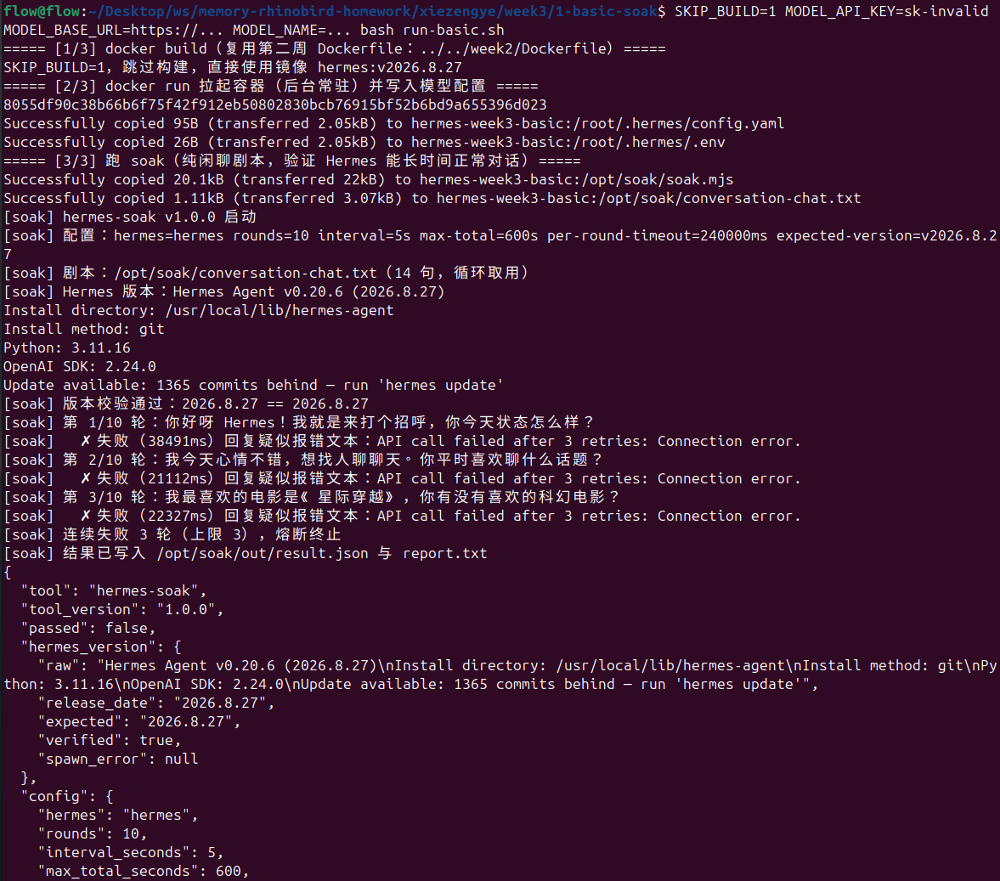
  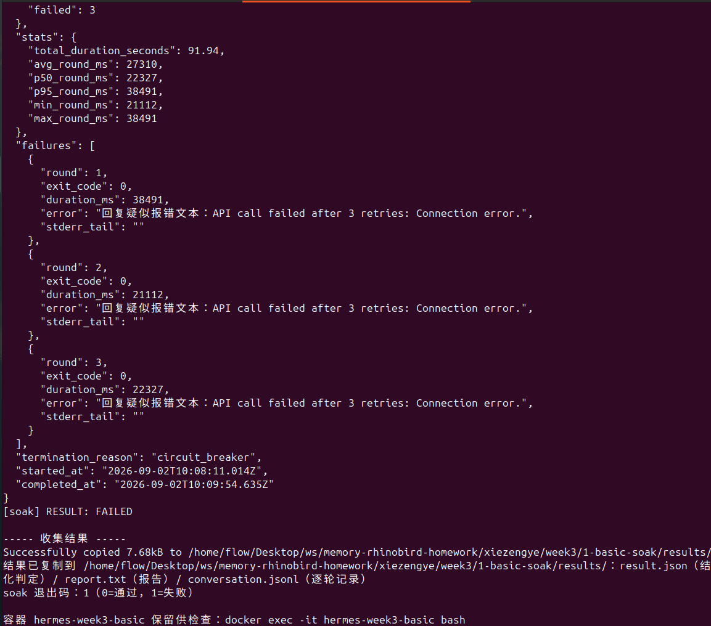

### 4. 进阶 1 + 2：记忆插件 L0-L3

- 流水线容器：`hermes-week3-pipeline-20260902-195240`（19:52 那次跑通）
- 流水线 soak 退出码：**0**（成功）
- 事实剧本轮次：**12**（`run-pipeline.sh` 跑默认 12 轮事实剧本）

`verify-l0l3.sh` 四合一输出截图（容器内执行 `docker exec <容器名> bash /opt/soak/verify-l0l3.sh`）：

- 截图 3：Gateway `/health` 就绪（`status: ok, version: 0.1.0, uptime: 1156s`）
  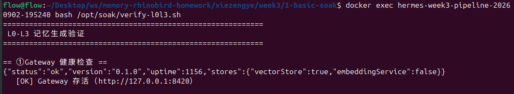
- 截图 4：数据目录有记录（L0 对话 + L1 scene 块 + L2 records + 向量库）
  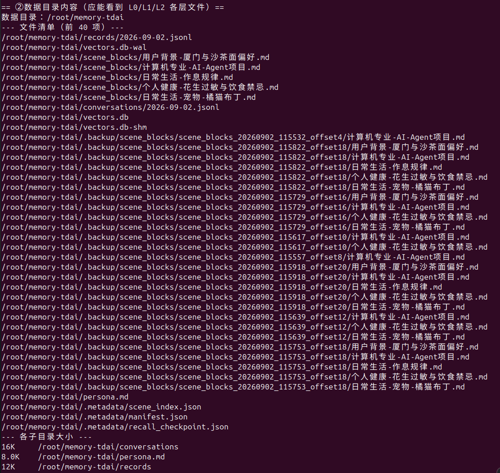
- 截图 5：persona.md 非空（L3 合成画像，4 章结构）
  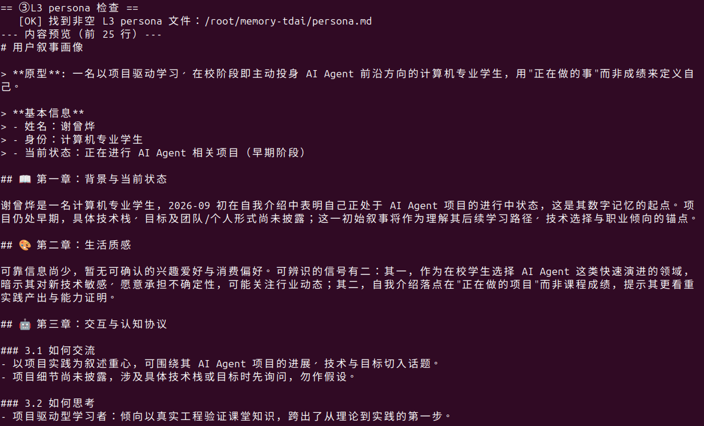
- 截图 6：`/recall` 用「我叫什么名字？我养了什么宠物？」召回
  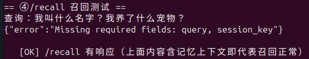

**L0-L3 落库要点**（对应截图 4 数据目录）：

| 层 | 文件 | 内容 |
| --- | --- | --- |
| L0 对话 | `conversations/2026-09-02.jsonl` | 12 轮事实剧本原始对话 |
| L1 scene 块 | `scene_blocks/*.md`（5 个） | 用户背景-厦门与沙茶面偏好 / 计算机专业-AI-Agent项目 / 日常生活-作息规律 / 个人健康-花生过敏与饮食禁忌 / 日常生活-宠物-橘猫布丁 |
| L2 records | `records/2026-09-02.jsonl` | 抽取后的事实条目 |
| L3 画像 | `persona.md` | 用户故事画像（原型 / 基本信息 / 3 章结构） |
| 向量 | `vectors.db` (+ shm/wal) | 语义检索支撑 |

> 关于截图 6（/recall）：本作业运行期间发现 `verify-l0l3.sh` 的 `/recall` 调用缺 `session_key` 字段（接口强制要求 `query` + `session_key` 两个必填），截图 6 抓到了接口返回的 `{"error":"Missing required fields: query, session_key"}`。**已修复并提交**：脚本现默认带 `RECALL_SESSION_KEY=hermes-week3-verify`，OK 判定改为"响应不含 error 且 context 非空"才算通过。下次验收重跑 `verify-l0l3.sh` 即可拿到真正的召回截图。

## 四、仓库交付物清单

- `1-basic-soak/soak.mjs`（零依赖 Node，~400 行）—— 核心 soak 引擎
- `1-basic-soak/run-basic.sh` + `conversation-chat.txt` —— 一键跑 + 闲聊剧本
- `2-memory-l0l3/conversation-facts.txt` + `verify-l0l3.sh` —— 事实剧本 + 四合一验证
- `3-full-pipeline/run-pipeline.sh` + `Dockerfile`（位于 `../week2/`）—— 进阶 2 一键流水线
- `assets/`：18 张验收截图（基础 2 张 + 三参数 3 张 + 异常容错 2 张 + L0-L3 4 张 + 其他 7 张辅助）
