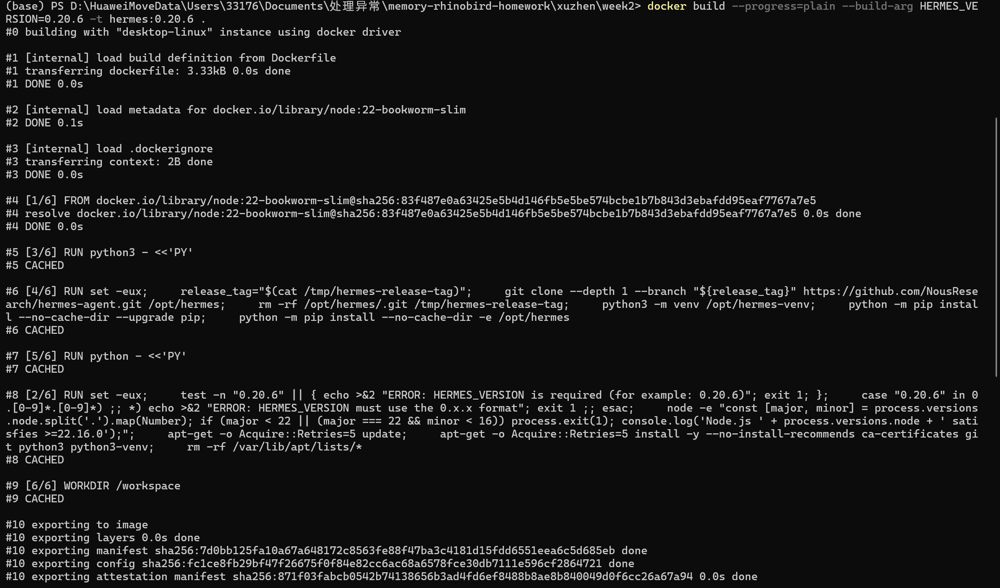
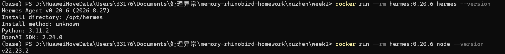
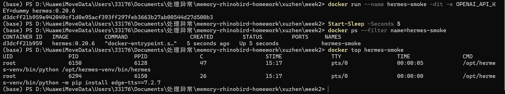

# 第二周作业：参数化 Hermes Dockerfile

本目录提供一个按版本构建的 Hermes 干净镜像。输入使用 Hermes 的语义化版本（`0.x.x`），Dockerfile 会自动找到官方日期式 Git tag，再安装对应源码。

## 构建

```bash
docker build --progress=plain \
  --build-arg HERMES_VERSION=0.20.6 \
  -t hermes:0.20.6 .
```

`HERMES_VERSION` 没有默认值，必须通过 `--build-arg` 传入。Dockerfile 会校验版本格式、从官方 tag 的 `pyproject.toml` 解析日期 tag、安装匹配源码，并在构建期断言安装版本完全一致，同时检查常见外部记忆插件未安装。

基础镜像是题目指定的 `node:22-bookworm-slim`，并在构建时检查 Node.js 不低于 `22.16.0`。Dockerfile 不使用 `COPY` 或 `ADD`，不会复制本仓库源码，也不安装 TencentDB-Agent-Memory。

## 版本验证

```bash
docker run --rm hermes:0.20.6 hermes --version
docker run --rm hermes:0.20.6 node --version
```

预期输出包含：

```text
Hermes Agent v0.20.6 (2026.8.27)
v22.x.x
```

## 启动验证

Hermes 默认是交互式 CLI。使用 TTY 启动，并在运行时提供模型凭据（不要写进 Dockerfile）：

```bash
docker run --rm -it \
  -e OPENAI_API_KEY="$OPENAI_API_KEY" \
  hermes:0.20.6
```

如只检查进程是否进入 Hermes，可使用占位 key 观察初始化界面：

```bash
docker run --name hermes-smoke -dit -e OPENAI_API_KEY=dummy hermes:0.20.6
docker ps
docker logs --tail 50 hermes-smoke
docker top hermes-smoke
docker rm -f hermes-smoke
```

## 验收截图

以下截图对应作业验收标准，原图保存在 `evidence/` 目录：

### 1. 根据版本号构建成功

构建命令传入 `HERMES_VERSION=0.20.6`，并成功生成 `hermes:0.20.6` 镜像。



### 2. 容器内版本与输入一致

容器内 Hermes 版本为 `0.20.6`，Node.js 版本为 `22.23.2`。



### 3. 容器正常启动并运行 Hermes

`docker ps` 显示容器状态为 `Up`，`docker top` 显示 Hermes 主进程正在运行。



## 参数化复验

再用另一个已发布版本构建，确认版本不是写死的：

```bash
docker build --progress=plain --build-arg HERMES_VERSION=0.19.0 -t hermes:0.19.0 .
docker run --rm hermes:0.19.0 hermes --version
```

## 五条硬要求对应关系

1. 版本号参数化：`ARG HERMES_VERSION`，无默认值，构建时用 `--build-arg` 传入。
2. 干净镜像：只安装 Hermes 核心，并在构建期检查常见记忆插件未安装。
3. 不 COPY 本仓库源码：Dockerfile 不含 `COPY`/`ADD`。
4. 预装 Node.js：基础镜像为 `node:22-bookworm-slim`，构建期检查 `>=22.16.0`。
5. README：本文件说明版本传入、构建、验证、启动和参数化复验。
首次构建需要访问 Docker Hub、GitHub 和 Python 包索引；网络失败时应根据构建日志重试，不要把 API Key 写入镜像或 Dockerfile。
