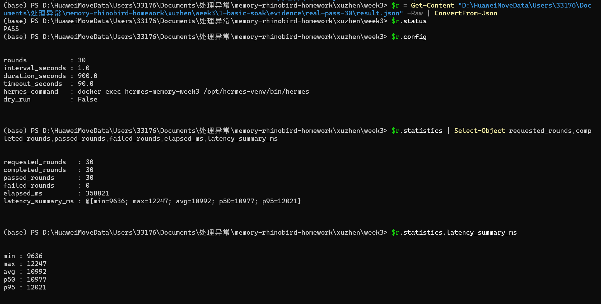
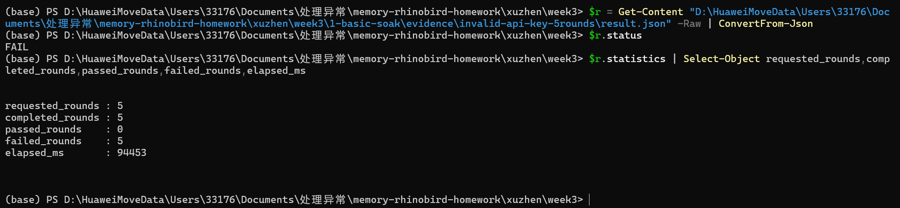

# 基础：Hermes 自动对话 soak

[返回第三周总览](../README.md)

`soak.py` 使用 Hermes 官方的非交互接口 `hermes --oneshot "..."`，自动连续发起多轮对话。每轮结果立即写入 JSONL，结束后写入结构化 `result.json` 和可读的 `report.txt`。

## 运行

在已安装 Hermes 的环境中：

```bash
python soak.py --rounds 10 --interval 2 --duration 120 --timeout 30 --output results
```

三个必需可配置项分别是 `--rounds`（轮次）、`--interval`（轮间隔，秒）和 `--duration`（总时长，秒）。`--timeout` 控制单轮超时。需要指定不同命令时使用 `--hermes-command` 或环境变量 `HERMES_COMMAND`。

## 结果与判定

`result.json` 的 `status` 明确为 `PASS`/`FAIL`，并包含请求/完成/成功/失败轮次、总耗时、每轮延迟以及 `min`/`avg`/`P50`/`P95`/`max` 延迟汇总。超时、空回复、Hermes 非零退出和常见鉴权错误都会记录为失败并继续下一轮，不会让脚本直接崩溃。

脚本会自动读取 `week3/.env`（也支持 `--env-file` 或 `HERMES_ENV_FILE` 指定其他文件）。因此 Hermes 的 `OPENAI_API_KEY` 与记忆 Gateway 的 `TDAI_LLM_*` 可集中在同一个 `.env`，运行时不会把密钥写进命令行。

在第二周 Docker 镜像中运行时，先启动一个常驻容器，再把 `docker exec` 作为命令前缀传入：

```bash
docker run --name hermes-soak -dit --env-file ../.env hermes:0.20.6
python soak.py --rounds 10 --interval 2 --duration 120 \
  --env-file ../.env --hermes-command 'docker exec hermes-soak hermes' --output results
```

使用 DeepSeek 时，同一个 `../.env` 中的 `DEEPSEEK_API_KEY` 与
`TDAI_LLM_API_KEY` 必须都填入有效 Key：前者供 Hermes 对话，后者供记忆
Gateway 抽取 L1-L3。

事实型剧本可通过 `--prompt-file ../2-memory-l0l3/facts.json` 传入；文件支持 JSON 字符串数组或“一行一个 prompt”。

没有模型凭据时可先用冒烟模式验证脚本和结果格式：

```bash
python soak.py --rounds 3 --interval 0 --duration 10 --dry-run --output results-dry-run
```

故意使用错误 API Key 验证容错（预期最终 `status=FAIL`，且仍生成结果文件）。DeepSeek 端点应同时覆盖 `DEEPSEEK_API_KEY` 与 `OPENAI_API_KEY`，并使用独立 `HERMES_HOME`，避免已有认证文件覆盖无效 Key：

```bash
DEEPSEEK_API_KEY=invalid OPENAI_API_KEY=invalid HERMES_HOME=/tmp/hermes-invalid \
python soak.py --rounds 3 --interval 0 --duration 60 --timeout 20 --output results-invalid-key
```

本目录的 `evidence/real-pass-30/` 保存了真实模型 30/30 PASS 结果；`evidence/invalid-api-key-5rounds/` 保存了无效 Key 下 5/5 FAIL 的完整结果，作为异常容错证据。

## 验收截图



*图 1：真实 Hermes soak 完成 30/30 轮。`config` 同时显示轮次 30、轮间隔 1 秒、总时长 900 秒；统计中成功 30、失败 0，并给出 P50/P95 延迟。*



*图 2：隔离的错误 API Key 场景完成 5 轮，全部被判为 FAIL；脚本仍输出完整统计，证明异常不会导致脚本崩溃或假通过。*
