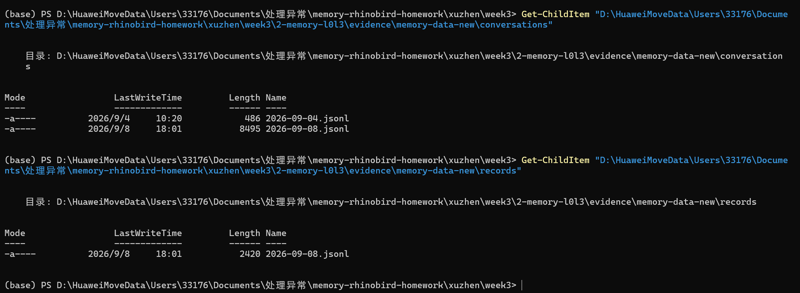
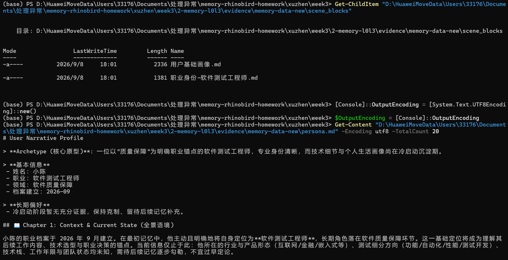
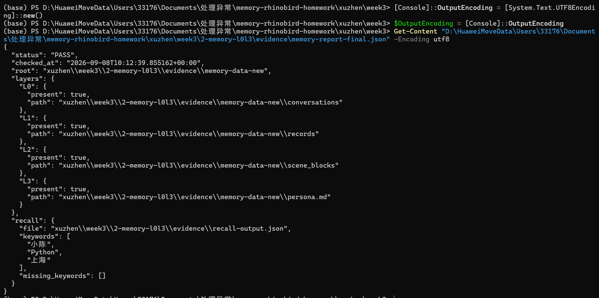

# 进阶 1：L0-L3 记忆验证

[返回第三周总览](../README.md)

`facts.json` 是富含事实、偏好、经历和约束的 soak 剧本。将这些句子逐轮发送给已安装记忆插件的 Hermes，再使用 `memory_probe.py` 检查四层产物和 `/recall` 输出。

## 建议流程

1. 按第二周 Dockerfile 构建干净 Hermes，并在容器内安装课程要求的记忆插件。
2. 使用 `1-basic-soak/soak.py` 的 `--hermes-command` 运行事实剧本（可将事实逐行作为 prompt 传给 `hermes --oneshot`）。
3. 导出 `/recall` 输出到文本文件，然后执行：

```bash
python memory_probe.py --root /path/to/hermes-memory \
  --recall-file recall.txt --keywords 小陈 Python 海风 --output memory-report.json
```

脚本会明确报告 L0/L1 记录、L2 scene、L3 persona.md 是否非空，以及 recall 缺失关键词；四层或召回任一失败时退出码为 1。插件实际目录分别为 `conversations/`、`records/`、`scene_blocks/` 和 `persona.md`。验收截图应覆盖数据目录、scene、persona.md 和 recall 结果。

## 本地安装验证

已基于第二周镜像 `hermes:0.20.6` 在容器运行时安装官方 npm 包
`@tencentdb-agent-memory/memory-tencentdb@latest`，并完成以下配置：

- Provider 链接到 `/opt/hermes/plugins/memory/memory_tencentdb`；
- Hermes 配置启用 `memory.provider: memory_tencentdb`；
- Gateway 监听 `127.0.0.1:8420`，`GET /health` 返回 `200`；
- 向 `/capture` 写入事实对话，L0 JSONL 已落库。

对应原始证据在 `evidence/`：`plugin-install.txt`、`gateway-health.json`、
`l0-conversations.jsonl` 和 `memory-data-files.txt`。

本次使用共享 `.env` 中的 DeepSeek Key 完成了真实抽取：L1 records、L2 scene blocks、L3 persona.md 均已生成；`POST /recall` 使用 `keyword` 策略返回 `code: 0`。证据位于 `evidence/memory-data-new/`、`evidence/recall-output.json` 和 `evidence/memory-report-final.json`。

## 验收截图



*图 3：L0 `conversations` 与 L1 `records` 目录均存在 JSONL 记录，证明原始对话和抽取后的事实均已落库。*



*图 4：L2 `scene_blocks` 已生成场景块，L3 `persona.md` 已写入“小陈”“软件测试工程师”等用户画像内容。*



*图 5：总检结果为 PASS；L0–L3 均为 `present: true`，`/recall` 已命中“小陈、Python、上海”，且没有缺失关键词。*
