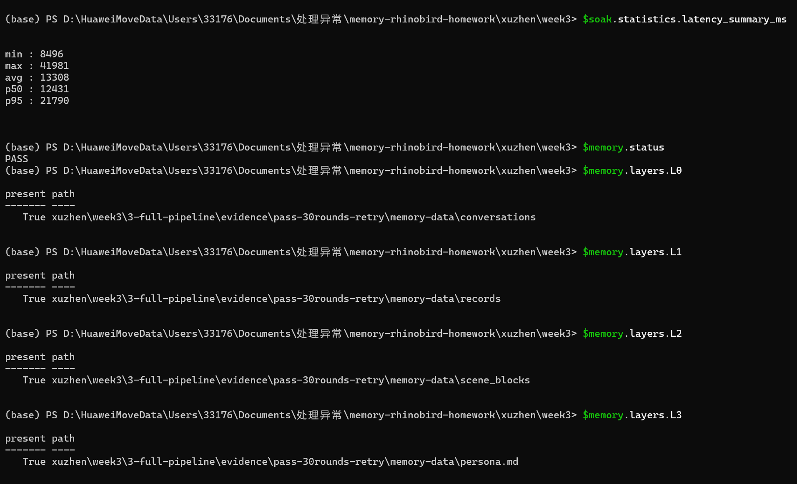

# 进阶 2：Hermes 完整流水线

[返回第三周总览](../README.md)

`run_pipeline.py` 是本作业的单命令入口：它复用第二周 Dockerfile，构建指定版本 Hermes，启动新容器，安装 TencentDB-Agent-Memory Provider，启动 Gateway，运行事实型 soak，并在清理容器前导出所有结果。密钥始终只从本机共享 `.env` 读取。

## 运行

先在 `week3/.env` 填好 Hermes 和 Gateway 共用的 Key（该文件已被 Git 忽略），然后从本目录执行：

```bash
python run_pipeline.py --version 0.20.6 --rounds 30 --interval 1 --duration 1800 --timeout 180
```

可用 `--env-file /path/to/.env` 指定另一份共享环境文件，`--output-dir /path/to/result` 指定导出目录，`--keep` 保留临时容器便于调试。`--rounds`、`--interval`、`--duration`、`--timeout` 均传给 soak；`--memory-settle` 控制 soak 后等待异步 L1-L3 抽取完成的时间。运行成功时 `pipeline status: PASS`，导出目录含：

- `soak-results/result.json`：逐轮对话的 PASS/FAIL 与延迟统计；
- `memory-data/conversations`、`records`、`scene_blocks`、`persona.md`：L0–L3 产物；
- `memory-report.json`：流水线结束后自动检查 L0–L3 的机器可读结论；
- `gateway.log`：Gateway 的 L1/L2/L3 处理日志。

`pipeline.py` 是底层编排器；它提供 `--copy` 与 `--copy-out`，用 `SOURCE=DESTINATION` 形式复制容器输入和导出结果，规避 Windows 路径冒号的歧义。

## 已实测

本机于 2026-09-08 对新容器完成了独立端到端运行：指定 `0.20.6`，30 条事实 soak 为 30/30 PASS，L0–L3 均已生成。证据见 `evidence/pass-30rounds-retry/soak-results/result.json`、`evidence/pass-30rounds-retry/memory-data/`、`evidence/pass-30rounds-retry/gateway.log` 和 `evidence/pass-30rounds-retry/memory-report.json`。

## 验收截图



*图 6：一键流水线的 soak 延迟统计与记忆检查结果。流水线以新容器完成 30/30 PASS，并导出 L0 conversations、L1 records、L2 scene blocks、L3 persona.md，四层检查均为 `present: true`。*
