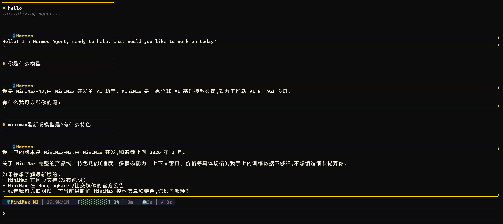
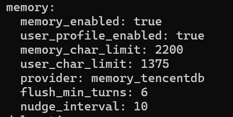
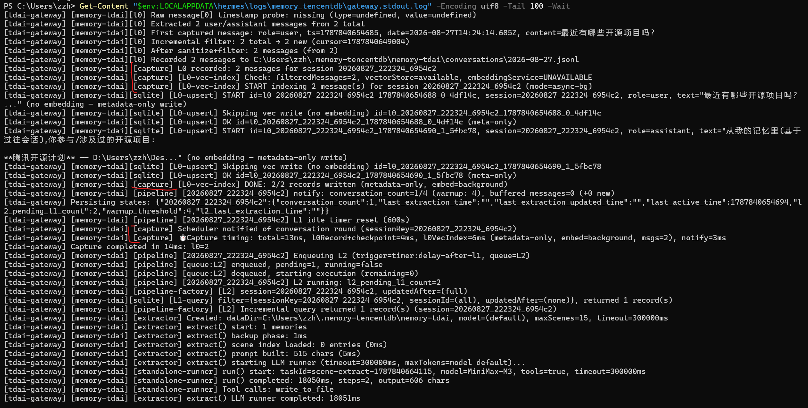
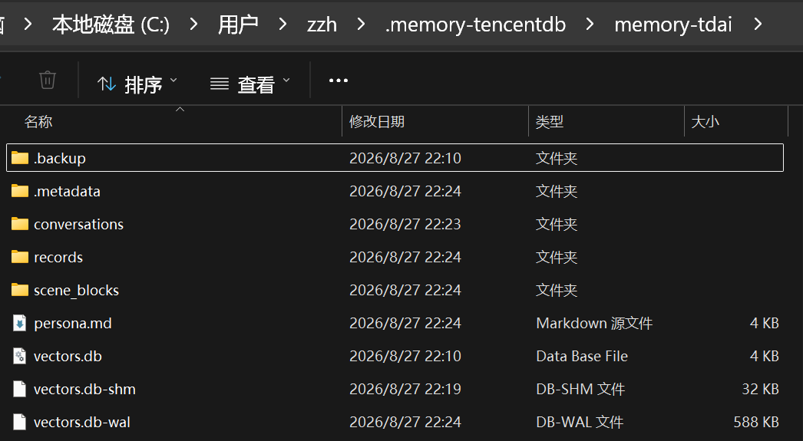

# 第一周作业：Hermes + TencentDB-Agent-Memory

## 1. 作业目标

在 Windows 原生 Hermes Agent 上接入 TencentDB-Agent-Memory `main` 分支，完成 Hermes 对话，并验证记忆插件已加载、Gateway 正常运行、对话内容成功落库。

## 2. 实验环境

- Windows
- Hermes Agent
- Node.js `v24.13.0`
- Python `3.11.15`
- TencentDB-Agent-Memory（`main` 分支）
- Gateway：`127.0.0.1:8420`
- 记忆后端：SQLite + 本地 BM25 检索

## 3. Hermes 配置

配置文件：

```text
C:\Users\zzh\AppData\Local\hermes\config.yaml
```

关键配置：

```yaml
memory:
  memory_enabled: true
  user_profile_enabled: true
  provider: memory_tencentdb
```

插件目录：

```text
C:\Users\zzh\AppData\Local\hermes\plugins\memory_tencentdb
```

## 4. Hermes 对话验证

启动 Hermes：

```powershell
hermes
```

截图展示了 Hermes 成功启动并完成正常问答。随后围绕开源项目和腾讯开源计划进行的对话被 Gateway 捕获，具体的 `capture`、L0～L3 处理结果见下方 Gateway 日志截图。



## 5. 插件配置与加载验证

通过 Hermes 的 provider discovery 验证插件已被发现：

```text
memory_tencentdb True
```



## 6. Gateway 验证

Gateway 运行地址：

```text
http://127.0.0.1:8420
```

健康检查：

```powershell
curl.exe http://127.0.0.1:8420/health
```

返回结果为 `status: ok`，说明 Gateway 已正常启动。

Gateway 日志中可以观察到完整的记忆处理链路：

```text
[capture] L0 recorded
L1 complete: extracted=1, stored=1
L2 complete
Persona generation succeeded
Capture completed
```



## 7. 记忆落库验证

记忆数据目录：

```text
C:\Users\zzh\.memory-tencentdb\memory-tdai
```

对话后生成或更新了以下内容：

```text
conversations\2026-08-27.jsonl
records\2026-08-27.jsonl
scene_blocks\开源实战-犀鸟计划.md
persona.md
vectors.db
```

- `conversations` 保存 L0 原始对话。
- `records` 保存 L1 结构化记忆。
- `scene_blocks` 保存 L2 场景记忆。
- `persona.md` 保存 L3 Persona 长期画像。



## 8. 结论

本次实验已完成第一周验收要求：

1. Hermes 成功完成对话。
2. `memory_tencentdb` provider 被 Hermes 识别并加载。
3. Gateway 在 `127.0.0.1:8420` 正常运行。
4. 对话被捕获并写入 L0 记忆。
5. Gateway 成功提取并保存 L1、L2、L3 记忆。

当前 `embeddingService=false` 表示没有启用向量 embedding，系统使用本地 SQLite + BM25 关键词检索；这不影响本次记忆保存和分层提取结果。
